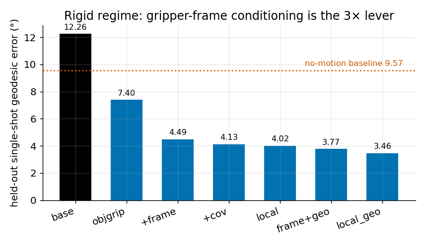

# Theme 1 — Object Interactions under Gripper Contraction (Rigid Tilt)

How a **successfully grasped** object tilts/settles as the parallel-jaw gripper closes. (Shared pieces → `00_overview.md`.)

## Design (world model)
- **Predict** the H=32-step **SE(3) trajectory** of the object (6D rotation + 3 translation per step) as the gripper closes.
- **Encoder**: shared `local` encoder (gripper-frame cloud + covariance + contact pool).
- **Head**: **DiT diffusion** (`wm/dit.py::DiTWM`, gripper-frame variant `wm/dit_local.py::DiTWMLocal`) — a Diffusion
  Transformer (AdaLN-Zero) denoising the H×9 delta-chunk. DDPM (ε-prediction, cosine schedule) + DDIM sampling. ~4.9M params
  (depth 4, D 256, heads 4).
- **Target**: H×9 SE(3) delta-chunk, per-dim z-scored (frame-independent).
- *Scope note*: this is the **full** gripper-closing trajectory on rigid-success data. The **short-window rollout**
  (K=10 from lift-onset, + read-off boolean) is a separate **slip**-scope experiment — see [02](02_slip_contact_dynamics_wm.md).

## Training config
- Code: `train.py` (arch `dit_local`); loader `my_dataset_hf_local.py`.
- Epochs 460 (fixed budget), batch 64, lr 1e-4 (AdamW), diffusion steps T=1000, H=32, **geodesic aux loss `--lam_aux 0.05`**.
- Seeds 0/1/2. Launcher: `slurm/train_arm.sbatch <tag> my_dataset_hf_local dit_local <seed> 0.05`.

## Experiments & results
- **Motivation**: the shipped model's reported "~18–21°" was **oracle best-of-8 + test-set checkpoint selection**; deployment
  is single-shot (N=1). Need a deployment-honest number.
- **Hypothesis**: expressing the cloud in the **gripper (contact) frame** exposes the contact configuration that determines tilt.
- **Results** (held-out **single-shot geodesic°**, ↓):
  - base (object frame) **12.26** — *worse than no-motion 9.57*.
  - **+frame (gripper frame) 4.49** — ≈**94% of the total gain (3× fix)**; = colleague's `+frame` idea.
  - +covariance 4.13 → +contact-pool (`local`) 4.02 → **+geodesic loss (`local_geo`) 3.46 = best**.
  - 3-seed: `local` 3.97 ± 0.15.
- **Analysis**: mechanism test (object-cloud + **object-frame target** = 12.1 ≈ base) → the win is the **contact frame
  specifically**, not generic input/output alignment. Gripper-as-pointcloud & L/R pooling = marginal/redundant. At the
  ~2–5° grasp-jitter floor (dataset card) → **FROZEN**. Contribution = **honest eval + clean attribution**, not a new architecture.

## Figure

*Held-out single-shot geodesic error across the ladder; `+frame` ≈ 94% of the gain, best `local_geo` **3.46°** (well below the no-motion 9.57° line). Generated by `make_figures.py`.*

## Terminology (ladder configs & metrics)
Precise definitions (for manuscript use). Each ladder rung adds one change to the previous.

| term | definition | N=1 geo° |
|---|---|---|
| `base` | Baseline model: gaussian cloud in the **object's own frame** with global max/mean pooling — the originally shipped configuration. | 12.26 |
| **`+frame`** | The gaussian cloud is re-expressed in the **gripper (contact) frame** (origin at the pinch point, jaws closing along +x) instead of the object frame. This single change accounts for ≈94% of the total error reduction — the "**3× lever**" (colleague's `+frame` idea). | **4.49** |
| `+cov` | Each gaussian's full **covariance** Σ = R·diag(s²)·Rᵀ is used as its feature (replacing the raw quaternion + scale), removing quaternion sign / axis-order ambiguity. | 4.13 |
| `local` | `+frame` + `+cov` + a **contact-weighted pooling** that weights each point by its distance to the pinch line (nearer → higher weight). This is our "grasp-local" encoder. | 4.02 |
| `+geo` / **`local_geo`** | Adds a **geodesic (SO(3) angular) loss** on the predicted rotation (colleague's auxiliary loss). `local_geo` = `local` + this loss = the best configuration. | **3.46** |
| `objgrip` / `gripframe` / `lr_geo` | Ablations: splice the gripper finger-pad **points** into the cloud (`objgrip`, `gripframe`), or pool the left/right finger contact regions separately (`lr_geo`). All found marginal or redundant with the gripper frame. | 7.40 / 4.57 / 3.63 |
| `no-motion` | Reference baseline that predicts the object does **not move** during closing (relative rotation = identity); the deployment floor a useful model must beat. | 9.57 |
| N=1 / single-shot | A **single** diffusion sample — the deployable setting. Contrast **oracle best-of-N**, which selects the closest of N samples using the ground truth (optimistic, non-deployable). | — |
| geodesic° | The **geodesic angular distance on SO(3)** between predicted and ground-truth object rotation, in degrees (lower = better). | — |

## Model & data
Release locations: model weights + code in GitHub
[Evolving_Environment/cdwm-world-model](https://github.com/BWangCN/Evolving_Environment/tree/main/cdwm-world-model);
dataset on Hugging Face [BWangCN/cdwm-grasp-dataset](https://huggingface.co/datasets/BWangCN/cdwm-grasp-dataset).

**Weights** (GitHub, in `cdwm-world-model/models/`)
- [`models/01_rigid_gripper/local_geo.pt`](https://github.com/BWangCN/Evolving_Environment/blob/main/cdwm-world-model/models/01_rigid_gripper/local_geo.pt) — best config (3.46°)
- [`models/01_rigid_gripper/base_hf.pt`](https://github.com/BWangCN/Evolving_Environment/blob/main/cdwm-world-model/models/01_rigid_gripper/base_hf.pt) — baseline
- [`models/norm_stats/`](https://github.com/BWangCN/Evolving_Environment/tree/main/cdwm-world-model/models/norm_stats) — z-score statistics

**Code** (GitHub)
- model: [`wm/dit.py`](https://github.com/BWangCN/Evolving_Environment/blob/main/cdwm-world-model/wm/dit.py)
- model: [`wm/dit_local.py`](https://github.com/BWangCN/Evolving_Environment/blob/main/cdwm-world-model/wm/dit_local.py)
- training: [`train.py`](https://github.com/BWangCN/Evolving_Environment/blob/main/cdwm-world-model/train.py)
- data loader: [`my_dataset_hf_local.py`](https://github.com/BWangCN/Evolving_Environment/blob/main/cdwm-world-model/my_dataset_hf_local.py)
- evaluation: [`eval_hf.py`](https://github.com/BWangCN/Evolving_Environment/blob/main/cdwm-world-model/eval_hf.py)

**Data** (HF dataset)
- [`grasps.npz`](https://huggingface.co/datasets/BWangCN/cdwm-grasp-dataset/blob/main/grasps.npz) — rigid v1 (171 objects / 15,013 grasps)
