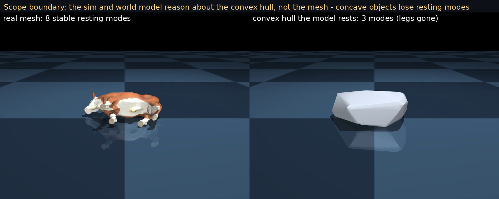

# Drop-Phase World Model

The task, per the corpus formulation (`BWangCN/cdwm-drop-corpus`): a world model of **where an object comes to rest after being released above a table** — object released → free-fall → impact → settle. The corpus records the full trajectory (world-frame pose at 31.25 Hz); the **learned target is the terminal resting pose** (its resting SE(3), and which stable **basin** it settles into), predicted from the object point cloud (the same Gaussian-cluster assets as the grasp WM) plus the release parameters — the fall itself is near-deterministic ballistics, so the modeling weight goes where the physics is interesting: the settle outcome. The drop regime completes the CDWM story: the natural corpus is largely a deterministic geometric mapping (a point predictor suffices), while near a stability boundary a hidden center-of-mass makes the outcome multimodal and a distributional world model becomes necessary.

Three regimes appear below — keep them distinct:
1. **Corpus task** (the formulation): natural releases (stable pose + ≤15° tilt, 5–80 mm height), CoACD collision physics, recorded full trajectories; the endpoint WM predicts the resting pose.
2. **Physics counterfactuals**: MuJoCo re-simulations sweeping the hidden CoM — mechanism illustrations, not model output.
3. **Gate B extension** (ours): near-boundary releases + per-episode hidden CoM + point-cloud-hull collision — a deliberately harder regime that is *not* representative of corpus physics.

Shared encoder throughout: `common.dit_local.DiTWMLocal` (the grasp encoder); only the head changes. `drop_net` is the point/regression head, `drop_diffusion.GateBDiT` the DiT diffusion head.

## Baseline drop WM (`drop.train_drop` / `drop.eval_drop`)
On the natural corpus the mapping is well posed. Held-out test (object-disjoint):
- resting-orientation error **2.38 degrees vs a no-motion predictor at 7.45** (non-overlapping CIs; unlike grasp, the point model beats no-motion), basin-transition AUROC 0.973.
- the **cloud is essential** (pose-only is at chance), and canonicalizing into the **release frame** roughly halves the rotation error versus the object frame.

So on the corpus as sampled, a point prediction is adequate. The interesting failure is the near-boundary, hidden-CoM regime below.

### Does supervising the settle trajectory help? (`drop.train_droptraj`)
A natural question is whether predicting **intermediate frames** — not just the endpoint — improves the resting-pose prediction. One reduction first: under the corpus's zero-velocity kinematic release, orientation is *constant* during free-fall and height is closed-form ballistics, so during-fall frames carry **no learning signal**; intermediate supervision meaningfully means the **contact-onset → settle transient**. We tested exactly that: same encoder, split, sampler, and protocol as the baseline, only the rotation head changed to K=8 anchor orientations spanning contact onset (detected as the first orientation deviation, which cannot occur before contact) to settle, equal chordal loss, endpoint read from the last anchor. Replicated across two seeds (paired per-episode dumps, object-bootstrap over the 12 held-out objects):

| arm | endpoint median | ≥15° tail median (n=313) | paired per-object gain vs baseline |
|---|---|---|---|
| `full_release` (H=1 endpoint baseline) | 2.38° | 16.51° (≈ no-motion 16.05°) | — |
| `traj_k8` seed 0 (K=8 transient supervision) | **2.01°** | 16.31° | endpoint **+0.28° [+0.08, +0.79] SIG** (10/12 objects) · tail +0.59 [−0.04, +2.42] ns |
| `traj_k8` seed 1 (replication) | **1.91°** | 21.74° | endpoint **+0.33° [+0.13, +1.07] SIG** (10/12 objects) · tail +0.74 [−0.88, +1.90] ns |

**Transient supervision significantly improves the endpoint, replicated**; it does **not** improve the ≥15° tail in either seed — the pooled tail median even swings between seeds (16.3° / 21.7°, both ≈ the 16.0° no-motion floor), itself evidence that a deterministic head lands arbitrarily on the which-way question. The tail failure is *which-way multimodality*, the Gate B distributional model's job, not supervision density. `traj_k8` is therefore the preferred endpoint-head candidate (checkpoint in `drop/models/baseline/traj_k8.pt`); `full_release` remains the reference baseline quoted above.

## Primary demo: the corpus task (`drop.render_corpus_demo`)
The formulation, end to end, on three **held-out** objects. Left: the **recorded corpus trajectory replayed** — real free-fall, impact, and settle from `obj_pos`/`obj_quat` at 31.25 Hz, no re-simulation. Middle: the endpoint WM's **predicted resting pose**, computed from the cloud and release parameters alone — before the drop happens. Right: errors, as-is.


Selection policy (uniform, disclosed): basin transitions exist for exactly one held-out object — the supplement bottle (44 tips; the corpus is shape-dominated) — which shows its *first* transition episode; the other objects have no transitions at these releases and show their *median*-net-rotation episode (a typical settle). The trio is representative of the per-object medians: 9 of 12 held-out objects are clear wins like the cube (1.9° vs 7.8°) and apple (4.6° vs 7.5°), and 2 are weak — the toy airplane (median 8.2°, tying no-motion) and the supplement bottle shown here as the honest tail: the point model cannot predict which way it tips (72.6°, tying no-motion), which is precisely the failure that motivates the Gate B distributional model below. Objects rest on their natural flat sides here because these are **natural corpus releases with the corpus's CoACD physics**; contrast the Gate B extension demos further down, whose near-boundary releases and shifted hidden CoM legitimately produce off-flat balanced poses.

## Corpus diffusion rollout: imagining the settle distribution (`drop.train_droproll`)
The endpoint demo above ends on the supplement bottle as the honest failure of a *point* model: it cannot predict which way a near-boundary bottle tips. This is the direct answer to that failure — a **distributional rollout** that imagines the settle as a *sample-able distribution*, not a single pose. It changes exactly one thing versus the trajectory arm: the head. The `traj_k8` head deterministically regresses the K=8 contact→settle anchors; here a **`GateBDiT` diffusion head (H=8)** *denoises* the same K=8 anchors, so the comparison isolates the head family (deterministic → distributional) with everything else — encoder, split, anchors — held fixed. No latent is used (the corpus has no hidden per-episode CoM; the multimodality is intrinsic to shape + release).

Results (test set, DDIM sampling): validation diffusion loss **0.027**; the endpoint read off the final anchor lands within **0.52°** for the best of S and **0.71°** for the median sample — the distribution concentrates tightly wherever the outcome is unimodal. The distributional payoff is on the multimodal tail: on the supplement bottle's tip episodes, **at least one of S samples reaches the tip mode 78% of the time** (data-derived tip cutoff, not a fixed threshold), and at S=8 **34 of 36 (94%)** of its tip episodes produce a sample distribution that *straddles* the cutoff — some imagined futures settle, some tip. This is exactly the ≥15° tail the deterministic heads (endpoint and `traj_k8`) provably tie no-motion on: it is a which-way *multimodality* the distributional head resolves by covering both outcomes, not a sharpness the point head was missing.


Same three held-out objects as the primary demo. Per row: **left** = the recorded corpus trajectory replayed (real free-fall/impact/settle, no re-simulation); **middle ×2** = two of **S=16** diffusion-sampled imagined settles. This is genuine model output (contrast the physics-counterfactual Gate B demos below), with two honesty conventions stated in-frame: the deterministic ballistic **fall is prepended in the render only** — the model does not generate the fall (zero-velocity release ⇒ constant orientation + closed-form height), it generates the contact→settle anchors — and the tip/settle **cutoff is data-derived** (largest gap in the object's ground-truth net-rotation distribution, ≈47°). The cube and apple settle in **every** sample (0/16 tip), matching their unimodal outcome; the supplement bottle **diverges** — 13/16 imagined futures settle back, 3/16 tip — the same release yielding different futures, and the distribution **covers the tip that actually happened**. The displayed pair is one settling + one tipping sample when both exist (disclosed in-frame); the full S=16 tally is shown in the remark. Fixed seed for reproducibility.

Pipeline: `precompute_droptraj` (K=8 contact→settle anchors) → `DropRollDS` (same anchors, formatted as the DiT target) → `train_droproll` (`GateBDiT` H=8, diffusion loss; test = DDIM best-of-S / median-of-S / tip-recall / divergence) → `render_droproll_demo` (recorded settle vs S imagined settles).

## Gate B: distributional WM (`drop.train_gateb` / `drop.eval_gateb`)
On 88 CoM-sensitive objects at near-boundary releases with a per-episode **hidden CoM** (a controlled explicit-inertial offset, mass and inertia held fixed so the CoM is the only varied quantity):
- **distribution >> point**, significant and large, and it **transfers** to unseen objects; the diffusion model is **well calibrated (ECE 0.015 vs the point predictor 0.227)**.
- the hidden CoM is **demonstrably causal**, three independent ways: model-free mutual information I(basin;CoM) 0.165 on CoM-sensitive vs 0.046 on negative controls; an oracle-latent model that is significant and specific to CoM-sensitive objects (null on controls); per-object distribution>point on 88/88.

Arms: `point` (regressor) | `diff` (no-latent diffusion) | `diff_oracle` (diffusion conditioned on the true CoM).

## Cross-object latent transfer (`drop.eval_transfer` / `drop.eval_transfer_hardening`)
Does knowing the CoM help on an object never seen in training (object-disjoint split, 19 held-out objects)? The CoM-to-basin mapping is object-geometry-specific, so an abstract `[axis, delta]` encoding does **not** transfer. Feeding the CoM **geometry-grounded** (for every cloud point, the vector to the CoM plus distance) does:
- grounded > no-latent **+0.184**, grounded > abstract **+0.191**, grounded > shuffled-CoM **+0.160** (all significant, paired object-bootstrap CIs).
- broad (grounded beats the baselines on **18/19** objects) and well calibrated (grounded ECE 0.019). The shuffled-CoM control rules out extra-channel capacity.

Four arms: `no_latent` | `abstract_oracle` | `grounded_oracle` | `shuffled_oracle`. The latent is the oracle CoM supplied at test.

## Inferring the CoM from observations — test-time instance adaptation (`drop.com_infer`)
The transfer arms are handed the true CoM. Here we **drop the oracle**: can the model *infer* the hidden CoM from a few observed drops of the same object instance, and predict the next drop better? An object instance has a fixed (but hidden) mass distribution; each drop's resting basin is evidence about it. Using the **frozen grounded WM as a likelihood** `P(basin | CoM, release)`, we do analytic Bayesian updating over a CoM grid: `p(CoM | k observed drops) ∝ ∏ P(basin_i | CoM, release_i)`, then predict a held-out drop by marginalizing the WM over the posterior. No new training, no new data — the 843 fixed-CoM instances are existing Gate B episodes grouped by their (3 mm-quantized) CoM. Evaluated on the **19 object-disjoint held-out objects** (transductive test-time adaptation, not zero-shot).

Predictive NLL of held-out query drops falls monotonically as more drops are observed:

| observed drops k | 0 | 1 | 2 | 4 | 8 |
|---|---|---|---|---|---|
| predictive NLL | 0.678 | 0.651 | 0.630 | 0.598 | **0.566** |

- **Paired per-object adaptation gain k=0→k=8: +0.111 NLL [+0.045, +0.212], significant, 17/19 objects.** (no-latent marginal = 0.744.)
- The posterior **concentrates** with evidence: entropy 3.39→2.82, and posterior mass on the true-CoM cell rises 0.03→0.05 (uniform = 1/33).
- **Marginalizing beats plugging in a single CoM**: the posterior-marginal predictive beats the MAP-CoM plug-in at every k (k=8: 0.566 vs 0.600) and stays better-calibrated (ECE 0.043 vs 0.065). Both even edge out the *true-CoM point estimate* (0.639) — under an imperfect WM, inferring the model's *effective* CoM and marginalizing is better than committing to the physical CoM. No support/query release-duplicate leakage (0/600 excluded at <5°).

An amortized encoder `q(CoM|obs)` (for fast/scalable inference) is a natural systems extension; the analytic posterior above is the information-theoretic reference and needs no training.

## Physical-density realism (`drop.multi_physical_density`)
Validation that the controlled explicit-inertial offset is a faithful proxy for real mass distribution, not a synthetic artifact. Across 6 CoACD-decomposed real-mesh objects, a randomized heavy-end per-hull **physical density** causally controls the basin in every object (paired near-boundary drops), reproducing the hammer result (I(basin;density) 0.161 vs the controlled-offset 0.165). Effect size tracks shape and is reported as a heuristic-sampled lower bound.

## Gate B demos: the hidden CoM decides the basin (physics counterfactuals, NOT model output)
> These clips are **MuJoCo ground-truth re-simulations, not drop-model rollouts.** They sweep the hidden CoM to show the *causal mechanism* behind the learned basin distribution (same object + release, different hidden CoM → different resting basin). They belong to the **Gate B extension regime** — near-boundary releases, per-episode hidden CoM, point-cloud-hull collision — so resting poses here can be off-flat (an object balanced near a saddle under a shifted CoM); that is the regime's physics, not corpus behavior. These motivate *why* the outcome is multimodal and are **not samples from the diffusion model**.

Rendered from the point-cloud hull via `drop.render_drop_demo`; per-object basin references from `drop.render_basins`.


*Banana: basin 1 → 0 → 0 → 1 across the four swept CoM conditions.*


*Medium clamp: basin 1 → 1 → 1 → 2.*


*Gaming mouse: basin 1 → 1 → 0 → 1.*

Basin indices are the object's stable resting poses ranked by probability (see `../figures/*_basins.png`).

## Data — two object universes
The project spans **two distinct object sets**, and it matters which each result uses:

- **Corpus task (`BWangCN/cdwm-drop-corpus`, the colleague's data): 80 unique objects** (108 object×config combinations; 153,996 settled episodes). **Uniform density → CoM at the geometric centroid** (no CoM diversity), **natural releases** (a stable pose + small tilt), so it is shape-dominated (objects mostly settle back). Used by the baseline endpoint WM, the trajectory-supervision arm, and the corpus diffusion rollout.
- **Gate B (our generation): 90 objects, 88 used** (the 2 `hammer` variants are excluded for a hull/cloud geometry mismatch), object-disjoint split 52/17/19. **CoM-sensitive objects drawn from the ~171-object grasp / WM#1 universe** — Gate B started as a 10-object pilot and was scaled up. Each episode adds the two ingredients the corpus lacks: a **near-boundary release** (tilted 15–55° toward a boundary between stable poses) and a **per-episode hidden CoM** (a controlled explicit-inertial offset along a principal axis). Used by Gate B, cross-object transfer, CoACD end-to-end, and CoM-from-observation.
- The two sets are **largely disjoint — only 17 objects overlap** (73 are Gate-B-only, 63 corpus-only). "Gate B" is a milestone name from our staged plan (Gate A: is CoM diversity worth building? → A.5: stress tests → **B: the CoM-aware distributional WM**), not an object subset of the corpus.

The near-boundary hidden-CoM episodes live under `drop/gateb/*_gateb_s0.npz` (compact: release quaternion, drop height, hidden CoM `[axis, delta]`, resting quaternion, basin). This 13 MB summary **deterministically regenerates the full trajectories** from `com_sim` (the quantized CoM the simulator used) given the point clouds and MuJoCo 2.3.7; `drop/gateb/verify_gateb.py` confirms a 100% basin match. See `drop/gateb/README.md`.

## Scope and limitation
The drop WM is a **terminal-state distributional world model**: it predicts a calibrated distribution over the *final resting pose / basin*, not the free-fall / impact / settling *trajectory*. In the CDWM family, grasp is an H=32 closing-trajectory WM and slip a K=10 lift-onset rollout WM; drop shares the same encoder but a single-step (H=1) head. Rolling out the settling dynamics for drop — so the model *imagines* the settle and diverges into different basins under different CoM — is a natural extension, not required for the hidden-CoM claim (the free-fall is near-deterministic; the multimodality is in the settle outcome). A trained rollout extension is shown next.

### Geometry: the convex-hull scope (Gate B extension only)
This limitation is scoped to the **Gate B extension**, not the corpus task: the corpus itself is simulated with **per-object CoACD convex decompositions** (≤24 hulls, the colleague's physics asset set), so the baseline WM's training and eval data already use faithful collision geometry. It is our Gate B episode generator that collides the object's point-cloud **single convex hull** instead. That was a deliberate scoped choice with two intrinsic reasons — a rigid-body simulator collides *convex* geometry natively, and the hull is matched to the world model's input cloud, so the Gate B model and its simulator share one shape representation with no geometry mismatch — and one practical reason: our local mesh set covers only the 29 Gate B objects that are also GRASP-project objects; the other 60 are standard Google-Scanned-Objects / YCB items whose meshes are **publicly available** but were not downloaded and standardized for this study. So the single hull is a scoped Gate B modeling choice, **not a data impossibility** (the meshes exist upstream); regenerating Gate B on decomposed geometry for all objects is future work.

**Global shape audit.** A data-derived audit (`drop.concavity_audit`) over the 29 objects that do have meshes measures the approximation with two global proxies. The **global convexity ratio** (mesh volume over hull volume) has median 0.52 and a natural gap near 0.74. The **contact-facing proxy** counts stable resting modes of the real mesh versus its hull (`trimesh.compute_stable_poses`): the hull loses a **median of only 1 mode** (mean 5.3 vs 4.4); it collapses modes mainly for a strongly concave minority (the Hereford bull: 8 modes to 3; a therizinosaurus: 8 to 4). These are honest measurements, but — as the boundary-regime study below shows — they answer "does this object look right at rest in general," not "does the hull distort the specific near-boundary episodes Gate B trains and evaluates on." The two questions turned out to have different answers.

**Boundary-regime measurement (`drop.hull_vs_coacd`).** For the same 29 objects, we re-simulated the actual Gate B near-boundary episodes with a CoACD convex-decomposition of the real mesh in place of the single hull — identical release and identical hidden CoM in both arms, so only the collision geometry differs — plus a 1.5°-release-wobble control that isolates ordinary near-boundary sensitivity from a geometry effect. Result: the release-wobble floor is high (agreement 0.95), confirming these episodes are genuinely boundary-sensitive; on top of that floor, **faithful geometry flips the resting basin 16–19% more often than the wobble alone**, even for objects the global proxy calls hull-faithful (convex-ish subset: **+0.16** gap; strongly concave: **+0.38**). So the global stable-pose proxy **under-states** hull sensitivity in the regime that matters: two bottles it rated "hull-faithful" turned out to have large boundary gaps (+0.31, +0.13), while `051_large_clamp` — which the global proxy flagged as too concave and which the first demo pass excluded — has one of the **smallest** gaps in the set (+0.05). This mirrors an earlier lesson from the density study (transition rate ≠ CoM-sensitivity): a global shape statistic does not predict in-regime dynamical sensitivity; only a direct test in the trained regime does.

**Does the Gate B mechanism survive this?** Yes, on the subset we can check. Re-stratifying the core Gate B result (distribution beats point, hidden CoM is causal; known-object reldisjoint split) by the boundary-regime geometry gap instead of the global proxy: dist>point gain is positive and stable across low/mid/high-gap thirds (**+0.473 / +0.520 / +0.425**), and the CoM-causality gain (oracle beats no-latent) is if anything **largest in the high-gap third** (+0.033 vs +0.023 low-gap); the per-object correlation between geometry gap and dist>point gain is weak (−0.27). **Coverage caveat:** this stratification covers the **28 of 88** reldisjoint-eval objects (6,758 episodes) that overlap the 29-object local mesh / CoACD audit — it tests whether the mechanism depends on *measured* hull sensitivity within the mesh-observable subset, not the full 88-object eval or the cloud-only remainder, where hull sensitivity cannot currently be measured. Within that subset, the mechanism does not concentrate in, or depend on, the hull-sensitive objects. What the hull approximation costs is the **fidelity of the predicted resting pose for a geometry-sensitive minority**, not the qualitative claim that a hidden latent drives multimodal outcomes.

**Limitation, stated precisely.** For a meaningful share of objects — not only the visibly concave ones — the single convex hull is not a faithful stand-in for the object's true near-boundary contact dynamics; roughly 1 in 5–6 boundary episodes would rest differently under faithful geometry. This is a genuine scope limitation on the *predicted resting pose*, not on the *distribution-over-point / hidden-latent-causality* claims, which hold under the more faithful geometry. The natural fix is convex decomposition (CoACD) integrated end-to-end — the world model's input cloud **re-sampled from the same decomposed geometry** used by the simulator. We ran exactly that (see "Does the mechanism survive on faithful geometry?" below): the core claims hold, so the limitation is on predicted-pose *fidelity* for a geometry-sensitive minority, not on the mechanism.


*The convex hull collapses the bull's 8 stable resting modes to 3 — an extreme, easily visible case of the geometry effect measured above. The simulator and world model reason about the hull (right), a legless blob; the detailed mesh (left) is the object we recognize but never enters the model.*

### Does the mechanism survive on faithful geometry? Yes (`drop.generate_coacd` / `drop.eval_coacd`)
We closed the loop the limitation above calls for: regenerate Gate B on the **CoACD convex-decomposition** of the real mesh (more faithful multi-hull collision) **and** feed the world model a cloud **re-sampled from the same real-mesh surface** — so simulator and WM input are geometry-consistent end to end. Retrained the arms object-disjoint on the 29 mesh objects (28 after excluding the hammer set; basins from real-mesh stable poses; object-bootstrap over the 7 test objects).

| arm | NLL | top-1 | ECE |
|---|---|---|---|
| point | 1.447 | 0.56 | 0.166 |
| no_latent (distribution) | 1.057 | 0.63 | 0.042 |
| abstract-CoM | 1.028 | 0.63 | 0.048 |
| shuffled-CoM (control) | 1.054 | 0.63 | 0.055 |
| grounded (hidden CoM) | **0.821** | **0.71** | 0.050 |

- **distribution > point: +0.355 NLL [+0.195, +0.537], significant, 7/7 objects.**
- **grounded > no_latent (hidden CoM is causal): +0.245 NLL [+0.179, +0.296], significant, 7/7 objects.**
- **grounded > abstract +0.212** [+0.156, +0.254] and **grounded > shuffled-CoM +0.236** [+0.177, +0.291], both significant 7/7 — the abstract encoding and the wrong-CoM control **both collapse to no_latent** (1.028, 1.054 vs 1.057), so the gain requires the *correct, geometry-grounded* CoM, not extra input channels. The full specificity result replicates on faithful geometry.
- Both core claims hold under faithful geometry, so they are **not artifacts of the single-hull approximation**. The CoM-causality gain is in fact **larger** here than on the single hull (+0.245 vs +0.184): faithful multi-hull geometry has more stable resting modes, so the hidden CoM decides the basin more often. (Absolute NLLs are higher than the hull task because the basin space is larger — hull-vs-CoACD numbers are not directly comparable; the *gains* are the claim.)

## Model-imagined rollout — Gate B hidden-CoM regime (extension)
> Distinct from the corpus diffusion rollout above: that one imagines the settle on the **natural corpus** (flat rests, no hidden CoM); this one is the **Gate B near-boundary regime** — per-episode hidden CoM, point-cloud-hull physics — so its diverging basins come from a *shifted hidden CoM* rather than shape+release alone, and resting poses can sit off-flat by construction.

Beyond the endpoint, a rollout variant (`GateBDiT` with **H=16**, trained on re-simulated settling trajectories) lets the model **imagine the settle itself**. Below, for three **held-out** objects, each row is: the MuJoCo **ground truth** (left), the trained model's **imagined** settle for the same release (middle), and the model's basin samples (right). Under a near-boundary release the samples **diverge into different basins** — the same distribution the endpoint model captures, now made temporal. Genuine model output (contrast the physics-counterfactual demos above). The three objects (a skillet lid, a large clamp, a conditioner bottle) were picked by the **boundary-regime geometry gap** above (0.03 / 0.05 / 0.13, the three lowest of the 29 measured), not the global convexity proxy — an earlier pass picked two bottles the global proxy called hull-faithful that turned out to have large boundary gaps (0.31, 0.13); this selection is corrected accordingly. As throughout the Gate B regime, resting poses here can sit slightly off-flat: a near-boundary release under a shifted hidden CoM legitimately balances an object away from its nominal flat side (contrast the corpus-task primary demo, where objects rest naturally flat).


Pipeline: `gen_rollout` (trajectory targets from `com_sim`) → `my_dataset_roll` (RollDS, K=16 target) → `train_roll` (`GateBDiT` H=K) → `render_grid` (textured-mesh GT-vs-model grid).

## Reproduce
```bash
MUJOCO_GL=egl python -m drop.render_corpus_demo                            # PRIMARY demo (corpus replay vs predicted rest)
python -m drop.precompute_droptraj                                         # K=8 contact->settle anchors (trajectory arm)
python -m drop.train_droptraj --tag traj_k8                                # trajectory-supervision arm (endpoint +0.3 deg)
python -m drop.train_droproll --tag roll_corpus                            # corpus DIFFUSION rollout (distributional settle; GateBDiT H=8)
MUJOCO_GL=egl python -m drop.render_droproll_demo                          # recorded settle vs S imagined settles (divergence demo)
python -m drop.train_gateb   --arm grounded_oracle --tag grounded_oracle   # train an arm
python -m drop.eval_transfer                                               # cross-object transfer eval
python -m drop.eval_transfer_hardening                                     # per-object breakdown + ECE
python -m drop.concavity_audit                                             # global convex-hull scope audit (two proxies)
python -m drop.hull_vs_coacd --obj <object> --n 250 --out <out.json>       # boundary-regime hull-vs-CoACD gap (per object)
python -m drop.aggregate_hvc                                               # aggregate the 29-object hull_vs_coacd runs
# CoACD END-TO-END geometry (does the mechanism survive faithful geometry? — Item 1):
python -m drop.gateb.generate_coacd --obj <object> --n 2500                # CoACD-physics Gate B episodes (29 mesh objects)
python -m drop.build_mesh_cloud --all                                      # real-mesh surface clouds (geometry-consistent WM input)
CDWM_GATEB_SRC=coacd python -m drop.train_gateb --arm grounded_oracle --tag coacd_grounded
CDWM_GATEB_SRC=coacd python -m drop.eval_coacd                             # dist>point + grounded>no_latent, object-bootstrap
# CoM FROM OBSERVATIONS — test-time instance adaptation (Item 2), uses frozen grounded_oracle + no_latent:
CDWM_GATEB_LATENT=grounded python -m drop.com_infer                        # Bayesian CoM posterior; predictive NLL vs k
MUJOCO_GL=egl python -m drop.render_drop_demo                              # regenerate the demo videos
# rollout WM (imagine the settle; K=16 trajectory targets regenerate from com_sim, ~75 MB, not shipped):
python -m drop.gen_rollout   --obj <object>                                # settling-trajectory targets -> gateb/<obj>_roll_s0.npz
python -m drop.train_roll    --arm grounded_oracle                         # train the rollout WM (GateBDiT H=16)
MUJOCO_GL=egl python -m drop.render_roll_pred                              # model rollout vs ground truth (held-out objects)
MUJOCO_GL=egl python -m drop.render_grid                                   # textured GT-vs-model grid (convex held-out objects)
MUJOCO_GL=egl python -m drop.render_scope                                  # scope-boundary figure (bull: real mesh vs convex hull)
```

## Terminology
- **no-motion** — trivial baseline: predict the resting pose equals the release pose (the object does not move). The honest floor any model must beat.
- **basin** — one stable resting pose of the object (which face it settles onto); the `basin` field is the id of the nearest stable pose (see the demos and `*_basins.png`).
- **Gate B** — the core distributional-WM experiment on CoM-sensitive objects at near-boundary releases (Gate A was the earlier density/CoM feasibility study).
- **NLL / Brier** — proper scores over the predicted basin distribution, lower is better: negative log-likelihood of the true basin, and squared error of the basin probabilities.
- **ECE** — expected calibration error: the average gap between predicted confidence and actual accuracy (near 0 = well-calibrated).
- **I(basin; CoM)** — mutual information; a model-free measure of how much the hidden CoM determines the basin.
- **arms** — `point` (regressor) · `no_latent` / `diff` (distribution, no CoM) · `abstract_oracle` (CoM as an `[axis, delta]` vector) · `grounded_oracle` (CoM as per-point vector-to-CoM + distance) · `shuffled_oracle` (grounded features but a wrong CoM, the control).
- **object-disjoint split** — train and test share no objects, so cross-object claims are about genuinely unseen geometry.
