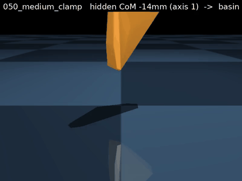
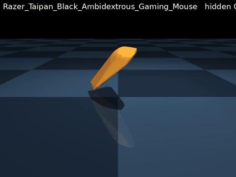
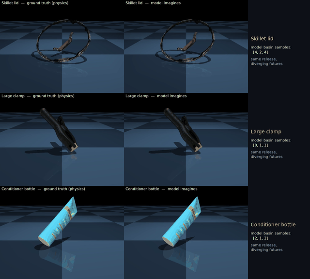

# Drop WM — exploratory: the hidden-CoM regime (Gate B)

> **Exploratory** — this is our own extension beyond the corpus task, on a **separate 88-object dataset** with **near-boundary releases + a per-episode hidden center-of-mass**. It is *not* representative of the colleague's corpus physics; it deliberately constructs a harder, multimodal regime to study when a *distributional* world model is necessary and whether the hidden CoM can be *inferred from interaction*. The main (corpus) deliverable is [`../docs/00_overview.md`](../docs/00_overview.md). Code + data live in the main `drop/` tree (see [`README.md`](README.md)).

Motivation: on the natural corpus a point predictor is adequate (see the baseline in the main overview). Near a stability boundary, a **hidden CoM** makes the resting outcome multimodal — the same visible input (cloud + release) lands in different basins depending on an unobservable mass distribution — and only a distributional WM can represent it.

## Data — the 88-object Gate B set (distinct from the corpus 80)
- **Gate B (our generation): 90 objects, 88 used** (2 `hammer` variants excluded for a hull/cloud mismatch), object-disjoint split 52/17/19. CoM-sensitive objects drawn from the ~171-object grasp/WM#1 universe. Each episode adds the two ingredients the corpus lacks: a **near-boundary release** (tilted 15–55° toward a boundary between stable poses) and a **per-episode hidden CoM** (a controlled explicit-inertial offset along a principal axis; mass/inertia fixed, only the CoM varies).
- **Only 17 objects overlap the corpus 80** (73 Gate-B-only). "Gate B" is a milestone name (Gate A: is CoM diversity worth building? → A.5: stress tests → **B: the CoM-aware distributional WM**), not a corpus subset.
- Episodes: `drop/gateb/*_gateb_s0.npz` (compact; regenerate full trajectories from `com_sim`; `drop/gateb/verify_gateb.py` → 100% basin match).

## Gate B: distributional WM (`drop.train_gateb` / `drop.eval_gateb`)
On the 88 CoM-sensitive objects at near-boundary releases with the per-episode hidden CoM:
- **distribution ≫ point**, significant and large, and it **transfers** to unseen objects; the diffusion model is **well calibrated (ECE 0.015 vs the point predictor 0.227)**.
- the hidden CoM is **demonstrably causal**, three independent ways: model-free mutual information I(basin;CoM) 0.165 on CoM-sensitive vs 0.046 on negative controls; an oracle-latent model significant and specific to CoM-sensitive objects (null on controls); per-object distribution>point on 88/88.

Arms: `point` | `diff` (no-latent diffusion) | `diff_oracle` (conditioned on the true CoM).

## Cross-object latent transfer (`drop.eval_transfer`)
Does knowing the CoM help on an object never seen in training (object-disjoint, 19 held-out)? An abstract `[axis, delta]` encoding does **not** transfer; feeding the CoM **geometry-grounded** (per cloud point, the vector to the CoM + distance) does:
- grounded > no-latent **+0.184**, > abstract **+0.191**, > shuffled-CoM **+0.160** (all significant, object-bootstrap CIs); broad (18/19 objects), well calibrated (ECE 0.019). The shuffled-CoM control rules out extra-channel capacity.

## Inferring the CoM from observations — test-time instance adaptation (`drop.com_infer`)
Drop the oracle: **infer** the hidden CoM from a few observed drops of the same object instance, and predict the next drop better. Using the **frozen grounded WM as a likelihood** `P(basin | CoM, release)`, do analytic Bayesian updating over a CoM grid; predict a held-out drop by marginalizing over the posterior. No new training/data (843 fixed-CoM instances = existing episodes grouped by their 3 mm-quantized CoM). 19 held-out objects.

| observed drops k | 0 | 1 | 2 | 4 | 8 |
|---|---|---|---|---|---|
| predictive NLL | 0.678 | 0.651 | 0.630 | 0.598 | **0.566** |

- **Paired per-object gain k=0→k=8: +0.111 NLL [+0.045, +0.212], significant, 17/19 objects** (no-latent marginal 0.744).
- Posterior concentrates (entropy 3.39→2.82; mass on the true-CoM cell 0.03→0.05). Marginalizing beats the MAP-CoM plug-in at every k (k=8: 0.566 vs 0.600) and stays better-calibrated (ECE 0.043 vs 0.065); no support/query release leakage (0/600).
- A *learned* amortized encoder `q(CoM|obs)` was an **informative null** — it learns a geometry prior but not the k-adaptation, so the analytic Bayesian inference is the effective method.

## Physical-density realism (`drop.multi_physical_density`)
The controlled explicit-inertial offset is a faithful proxy for real mass distribution: across 6 CoACD-decomposed real-mesh objects, a randomized heavy-end per-hull physical density causally controls the basin in every object (I(basin;density) 0.161 vs controlled-offset 0.165).

## Material-density realism — measured, then set aside
We (LLM) proposed per-object/per-part material densities and measured the basin-flip vs the corpus's uniform density (clean CoM-only sims). Finding: material-CoM realism is real but **narrow** — only ~4/76 objects are robustly CoM-sensitive, dominated by **standable containers with variable contents** (supplement bottles/powders: +0.47–0.80 flip; tiny CoM shift but decides upright-vs-tip). Visible-material tools are too thin (straightener/can-opener only); flat/blocky/solid/dishware objects are unaffected despite large CoM shifts (hammer: 72 mm shift, +0.02 flip). CoM *magnitude* ≠ outcome effect (it's CoM × basin-structure). Conclusion: the material signal folds into the **hidden** axis (container full/empty = hidden CoM), not a broad realism task — set aside.

## Gate B demos: the hidden CoM decides the basin (physics counterfactuals, NOT model output)
> **MuJoCo ground-truth re-simulations, not drop-model rollouts.** They sweep the hidden CoM to show the *causal mechanism* (same object + release, different hidden CoM → different resting basin). Near-boundary + shifted CoM + point-cloud-hull collision → resting poses can be off-flat by construction.


*Banana: basin 1 → 0 → 0 → 1 across four swept CoM conditions.*


*Medium clamp: basin 1 → 1 → 1 → 2.*


*Gaming mouse: basin 1 → 1 → 0 → 1.*

Basin indices = the object's stable resting poses ranked by probability (`figures/*_basins.png`).

## Geometry: the convex-hull scope (Gate B extension only)
The corpus uses per-object CoACD decompositions (faithful); it is *our Gate B generator* that collides the object's single point-cloud **convex hull** (a scoped choice: a rigid-body sim collides convex geometry natively, and the hull matches the WM's input cloud). Boundary-regime measurement (`drop.hull_vs_coacd`, 29 mesh objects): above a 1.5°-wobble floor, **faithful geometry flips the resting basin 16–19% more often** — roughly 1 in 5–6 boundary episodes rest differently. This costs *predicted-pose fidelity for a geometry-sensitive minority*, not the distribution/causality claims.


*The hull collapses the bull's 8 stable resting modes to 3.*

## Does the mechanism survive on faithful geometry? Yes (`drop.generate_coacd` / `drop.eval_coacd`)
Regenerate Gate B on the **CoACD decomposition** of the real mesh **and** feed the WM a cloud **re-sampled from the same real-mesh surface** (geometry-consistent end to end). Object-disjoint over the 29 mesh objects (28 after excluding hammer; bootstrap over 7 test objects):

| arm | NLL | top-1 | ECE |
|---|---|---|---|
| point | 1.447 | 0.56 | 0.166 |
| no_latent (distribution) | 1.057 | 0.63 | 0.042 |
| abstract-CoM | 1.028 | 0.63 | 0.048 |
| shuffled-CoM (control) | 1.054 | 0.63 | 0.055 |
| **grounded (hidden CoM)** | **0.821** | **0.71** | 0.050 |

- **distribution > point +0.355** [+0.195, +0.537] SIG (7/7); **grounded > no_latent +0.245** [+0.179, +0.296] SIG (7/7); grounded > abstract **+0.212**, > shuffled **+0.236**, both SIG 7/7 (abstract + wrong-CoM collapse to no_latent → needs the *correct* geometry-grounded CoM).
- The core claims hold under faithful geometry → **not a hull artifact**; the CoM-causal gain is *larger* than on the single hull (+0.245 vs +0.184).

## Model-imagined rollout — Gate B hidden-CoM regime
Distinct from the corpus diffusion rollout (which imagines the settle on the *natural corpus*): this is the **Gate B regime** — per-episode hidden CoM, hull physics, so diverging basins come from a shifted CoM. A `GateBDiT` H=16 rollout imagines the settle for 3 held-out objects; samples diverge into different basins.



## Reproduce
```bash
python -m drop.train_gateb   --arm grounded_oracle --tag grounded_oracle
python -m drop.eval_transfer
CDWM_GATEB_LATENT=grounded python -m drop.com_infer                        # Bayesian CoM posterior; NLL vs k
python -m drop.hull_vs_coacd --obj <object> --n 250 --out <out.json>       # boundary-regime hull-vs-CoACD gap
python -m drop.gateb.generate_coacd --obj <object> --n 2500                # CoACD-physics Gate B episodes
python -m drop.build_mesh_cloud --all
CDWM_GATEB_SRC=coacd python -m drop.train_gateb --arm grounded_oracle --tag coacd_grounded
CDWM_GATEB_SRC=coacd python -m drop.eval_coacd
MUJOCO_GL=egl python -m drop.render_drop_demo                              # Gate B CoM-sweep demos (physics counterfactuals)
MUJOCO_GL=egl python -m drop.train_roll --arm grounded_oracle && python -m drop.render_grid
```
