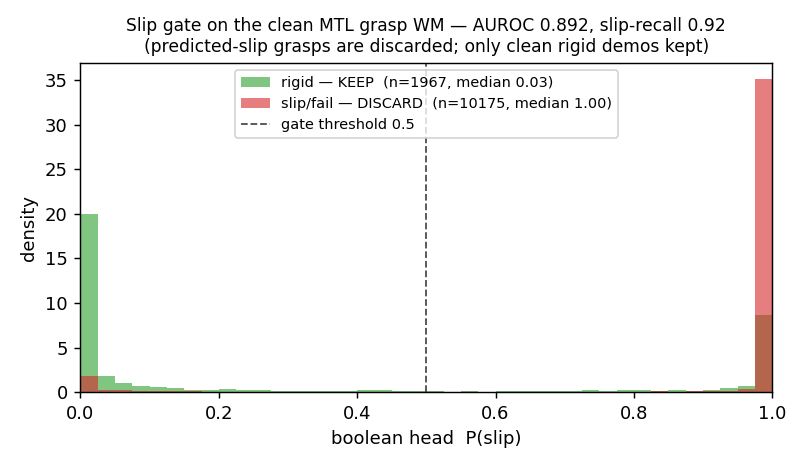

# Grasp WM for VLA data generation — clean multi-task model (ship v1)

The grasp-stage world model for the VLA data-generation pipeline. **One model** predicts the object's in-gripper settle
*and* filters unstable grasps, so the pipeline emits only clean successful-grasp demos.

## Design (the locked clean workflow)
- **One dataset**, all outcomes (`outcomes_v2`): every episode carries the grasp geometry, the (re-derived) H=32
  closing-settle trajectory, and its 5-way outcome label.
- **One model — multi-task (MTL):** a shared point-cloud encoder trunk → **private trajectory branch** (DiT diffusion
  head, rolls out the H=32 object-in-gripper settle) + **private boolean branch** (slip head: rigid vs not-rigid).
- **Per-batch multi-task loss:** diffusion (ε + geodesic) **masked to rigid** episodes + boolean cross-entropy on **all**
  outcomes, Kendall-weighted. Trained **from scratch**; private branches prevent the boolean from degrading the trajectory.
- **Use = gate then roll out:** `P(slip) = classify(scene, grasp)`; if high → **discard**; else roll out the trajectory.

## Result (held-out test)
| | value |
|---|---|
| Trajectory endpoint geodesic (single-shot) | **3.05°** |
| Trajectory endpoint geodesic (best-of-8) | **1.53°** |
| Boolean slip AUROC | **0.892** |
| Boolean slip-recall | **0.92** |
| Negative transfer (trajectory cost of adding the gate) | **none** |

The private-branch, from-scratch design gives a trajectory on par with the standalone tilt model (3.46° benchmark) while
carrying a strong slip filter — a naive shared-encoder retrofit paid ~0.9° for the same filter.

## Figures

*Boolean slip gate: rigid median P(slip) 0.03, slip/fail median 1.00 (AUROC 0.892). Predicted-slip grasps are discarded.*

*The model rolls out the in-gripper settle for a kept grasp (P(slip)=0.00); the 8 samples cluster tight = one reliable
future. (Rigid grasps are inherently low-tilt — the high-tilt grasps are the slippy ones the gate discards.)*

## Model & code
- Weights: `grasp/models/grasp_mtl.pt` (Git-LFS). Reproduce with the dev code (`wm/grasp_mtl.py`,
  `my_dataset_grasp_mtl.py`, `train_grasp_mtl.py`, `compute_settle_target.py`, `eval_grasp_mtl.py`).
- Data: object point clouds + `outcomes_v2` (this dataset). The rigid settle target is re-derived from the raw
  trajectories (round-trip validated).

## Role in the VLA pipeline (target policy: π0.5)
The WM is the **physics/outcome engine**: it generates the object's response + a keep/discard label; robot actions and
rendering come from a ManiSkill (SAPIEN) embodiment (Franka FR3 / UR + Robotiq 2F-85). Next stages ship separately:
**drop** (place dynamics + a settle gate) and **vla** (embodiment + language + records).
