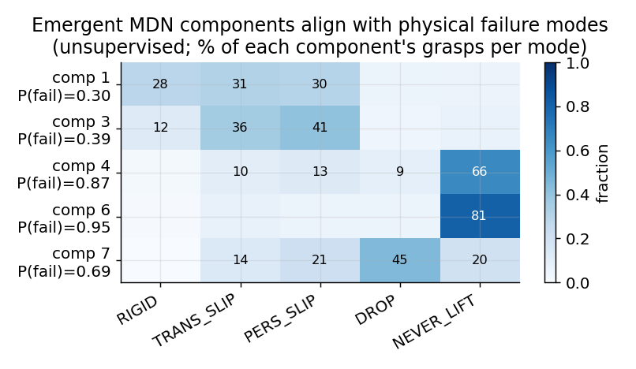
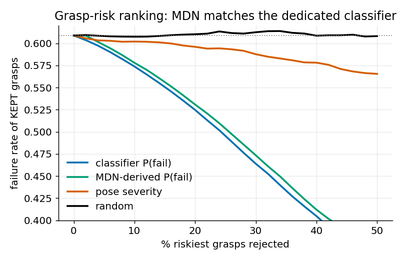
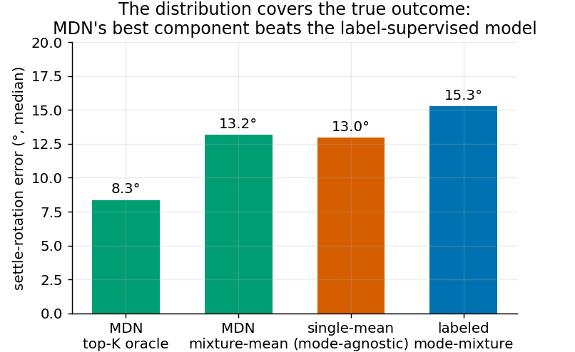
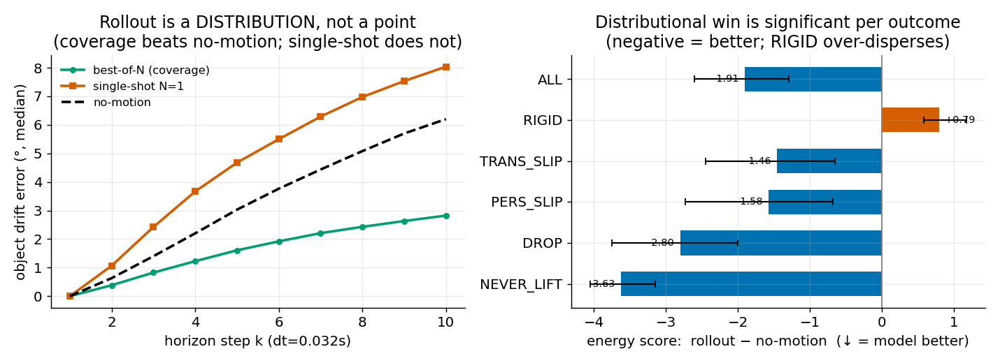

# Theme 2 — Contact-Dynamics World Model (Slip / Drop / Hold)

The core slip-scope result: from t=0 geometry, predict a **calibrated distribution over contact outcomes** — plus two
colleague-suggested coupling designs tested as controls. (Shared pieces → [00_overview.md](00_overview.md).)

> **Featured WM = the DiT diffusion rollout** (§(ii) below + its inline prediction gifs) — the colleague's canonical head,
> shared with the grasp task ([01](01_rigid_gripper_contraction.md)). The MDN below is an **exploratory summary-space
> alternative** (a 15-d motion *summary*, mode-agnostic) kept for the record but **de-emphasized**; it is not the shipped
> model. See `alignment_diffusion.md`.

## Design (world model)
- **Data**: `outcomes_v2` — full close→lift→outcome SE(3) trajectories + **5-way outcome labels**
  {RIGID, TRANSIENT_SLIP (success) · PERSISTENT_SLIP, LIFTED_DROPPED, CLOSED_NEVER_LIFTED (failure)}.
- **Phase-1 classifier** (`wm/classifier.py::OutcomeNet`): shared encoder → 5-way mode head + 2-tier success/fail head
  (post-hoc temperature scaling at eval).
- **Phase-2 target**: 15-d **object-in-moving-gripper motion summary** (settle 6D+trans, max-drift, slip-rate, drop-time,
  held-frac) — `compute_traj_summaries.py` → `traj_summaries.npz`.
- **Exploratory summary head = MDN** (`wm/trajnet.py::MDNTrajNet`, *de-emphasized — see banner*): shared encoder →
  **K=8-component Gaussian mixture** over the 15-d summary; **mixture NLL**; mode-agnostic (no threshold labels) — modes
  emerge as components. (Baselines in same file: `TrajNet` labeled per-mode experts; `DirectTrajNet` single-mean.) The
  **featured** WM is the DiT diffusion rollout in §(ii), which denoises the raw per-step trajectory rather than a summary.

## Training config
- Classifier: `train_cls.py` — epochs 80, bs 256, lr 1e-3.
- MDN: `train_mdn.py` — epochs 100, bs 256, lr 1e-3, **K=8**, AdamW wd 1e-4, cosine, grad-clip 5, uniform sampling.
- Loaders: `my_dataset_outcomes.py` (t=0 + labels), `my_dataset_traj.py` (z-scored summary target).
- Robustness: K∈{4,6,8,12}, seeds {0,1,2} (`train_mdn.sbatch`, `eval_mdn_robust.py`).

## Experiments & results (main WM)
- **Motivation**: rigid is at its floor; the frontier is **non-rigid** dynamics (mentor's world-model goal).
- **Hypotheses**: (H1) geometry predicts the **failure MODE**; (H2) the outcome is **multimodal** (same grasp → hold/slip/drop)
  → predict a **distribution**, not a point.
- **Results**:
  - **Identifiability**: outcome predictable from t=0 (nn-agreement 0.81) with a **~13% aleatoric boundary**.
  - **Phase-1**: geometry → **mode** (5-way macro-F1 **+0.20**, DROP-AUPRC +0.12) but **not coarse fail** (pose-driven).
    Classifier `P(fail)` = grasp ranker: reject 30% → **95% precision**, kept-fail 61→46%.
  - **(a′) single-mean regression FAILS** on the multimodal target → confirms H2.
  - **MDN (main)**: top-K coverage **8.35° [7.19, 9.84]** beats label-supervised **15.26** (paired Δ **−12.23 [−14.1, −10.5]**);
    NLL −3.07 (cloud) vs −1.17 (pose); **components align with physics unsupervised**; MDN-`P(fail)` ≈ classifier (RC-AUC 0.496 vs 0.488).
    Robust across K∈{8,12} and seeds; modes recur.
- **Analysis**: *geometry → a calibrated **distribution** over contact outcomes*; physical failure modes **emerge
  unsupervised**; yields a **deployable grasp-risk signal**. Ceiling = ~13% aleatoric mode boundary; coarse fail is pose-driven.

## Coupling-design validations (colleague-suggested, pre-registered controls with CIs)

### (i) Joint MDN + boolean head
- **Design** — `wm/trajnet.py::JointMDNOutcomeNet`: one shared encoder → **MDN head + binary success/fail head**, jointly
  trained; losses combined by **learned Kendall uncertainty weights** (no hand-tuned coefficients). Config — `train_joint.py`:
  epochs 100, bs 256, lr 1e-3, K=8; `joint_full` (cloud) + `joint_pose` (control).
- **Motivation/hypothesis**: does **joint** training sharpen the shared representation vs **separate** MDN + classifier?
- **Result (CLEAN-NEGATIVE)**: boolean only **ties** the dedicated classifier (risk-AUC 0.491 vs 0.488, acc ~0.77); MDN
  **degrades** (test NLL **−1.40 vs −3.07**; Kendall up-weighted the MDN ≈276× yet it overfit). → **separate decomposition
  is strictly better** — joint success supervision does not help and hurts the WM.

### (ii) Short-window rollout DiT + read-off boolean ("visualize the future")
- **Design** — `wm/dit_rollout.py::DiTRollout`: shared encoder → **DiT denoiser** over the **K=10-step object-in-gripper
  trajectory from lift-onset** (target = motion *relative to onset*), trained on **all outcomes**; + a **read-off** boolean.
  Boolean grad co-trains the encoder, but its **P(fail) is NOT fed into the DiT** (keeps clean `p(traj | scene, action)`).
  Config — `train_rollout.py`: epochs 120, bs 256, lr 1e-3, diffusion T=1000, **K=10**; precompute `compute_traj_full.py`
  → `traj_full.npz`; loader `my_dataset_trajfull.py`. `roll_full` (cloud) + `roll_pose` (control).
- **Motivation**: colleague's "visualize the future". **Window chosen from data** (`diagnostic_window.py`): outcomes separate
  by ~k5; the late transient-vs-persistent split is the irreducible aleatoric boundary → model the predictable onset.
- **Result** (object-bootstrap 95% CI): wins as a **distribution** — energy score rollout−no-motion **−1.91 [−2.5, −1.3]**
  (DROP −2.80, NEVER_LIFT −3.63); **geometry sharpens** (full−pose **−1.08 [−1.3, −0.9]**). Honest limits (all significant):
  **single-shot k10 worse than no-motion +2.91 [+2.2, +3.7]**; RIGID over-disperses +0.79; boolean read-off **not better than
  the classifier** (Brier +0.031, AUROC 0.831). → a **near-term-dynamics + visualization WM**, *not* a superior risk head.
- **Design decisions**: feed-**predicted**-P(fail)→DiT = **skip** (P(fail)=f(cond), a no-op); **true-outcome-conditioned** DiT
  (controllable counterfactual rendering) = **deferred** optional.

## Uncertainty (object-bootstrap 95% CI, B=1000 — `bootstrap_ci.py`)
Paired per-object deltas (same episodes); every claim, incl. the honest negatives, is significant (CI excludes 0):

| paired delta (neg = first better) | mean | 95% CI |
|---|---|---|
| MDN top-K − labeled-mixture (settle°) | **−12.23** | [−14.11, −10.50] |
| rollout − no-motion energy (ALL) | **−1.91** | [−2.53, −1.31] |
| full − pose energy (geometry sharpens) | **−1.08** | [−1.26, −0.90] |
| single-shot k10 − no-motion (*honest: worse*) | +2.91 | [+2.19, +3.69] |
| read-off − classifier Brier (*honest: worse*) | +0.031 | [+0.014, +0.049] |

## Figures

*Fig 1 — the MDN's mixture components (unsupervised) line up with the 5 physical outcomes; failure-rate gradient 0.30→0.95.*

*Fig 2 — MDN-derived P(fail) ≈ the dedicated classifier as a grasp ranker (reject riskiest x% → kept-failure rate).*

*Fig 3 — MDN top-K coverage 8.35° beats the label-supervised mode-mixture 15.26° (per-mode median = 124.5°).*

*Fig 5 — (left) coverage beats no-motion but single-shot does not; (right) per-outcome energy-score delta with 95% CIs (negative = model better; RIGID over-disperses). Generated by `make_figures.py` (1–3) and `fig5_rollout.py` (5).*

**Rollout clips** — representative episodes in the **world frame**: the floating parallel-jaw mount (gray ⊓) lifts off the table and the object holds / tilts / tumbles with it. Each frame shows the object's real 3DGS gaussians (points), its **oriented bounding box** (blue) and **body axes** (RGB), the **mount** (which lifts), and the **table** (faint plane). Via `render_rollouts.py`. *(The dataset has no gripper mesh — the gripper is a pose-only "floating parallel-jaw mount" — so the jaws are drawn from `base_pos`/`base_quat`.)*
- [rigid — Perricone MD box package held steady (end-drift 3°)](../figures/rollout_rigid.mp4)
- [transient-slip — Marc Anthony conditioner bottle tilts (19°)](../figures/rollout_slip.mp4)
- [lifted-dropped — Krill Oil bottle rises out of the gripper (95°)](../figures/rollout_drop.mp4)

**Predicted vs ground truth** — the trained DiT-rollout WM's own predictions (`render_pred.py`; gripper frame, K=10 window): GT object = blue oriented box + cloud, the model's N=8 samples = orange boxes. The predicted **spread grows with outcome uncertainty** — visualizing the *calibrated distribution over near-term futures* (mp4 links are higher-res):

| rigid (confident hold) | transient-slip (moderate) | lifted-dropped (multimodal) |
|:---:|:---:|:---:|
|  |  |  |
| samples cluster **tight** on GT | **moderate** spread | **wide** spread (uncertain) |

*Inline gifs above; full-res: [rigid](../figures/rollout_pred_rigid.mp4) · [slip](../figures/rollout_pred_slip.mp4) · [drop](../figures/rollout_pred_drop.mp4). The orange sample cloud widening from left→right is the calibrated distribution over futures — the DiT diffusion rollout's core behavior.*

## Terminology (models & metrics)
Precise definitions (for manuscript use).

| term | definition | headline result |
|---|---|---|
| 5-way outcome modes | The grasp's final outcome, one of: **RIGID** and **TRANSIENT_SLIP** (both counted as *success*); **PERSISTENT_SLIP**, **LIFTED_DROPPED**, **CLOSED_NEVER_LIFTED** (all *failure*). | success 47% / fail 53% |
| **MDN** (mixture-density network) | Network that outputs a **K-component Gaussian mixture** over the continuous 15-d outcome-summary, trained by mixture negative-log-likelihood. It models the outcome **distribution** with no hand-set mode thresholds — modes emerge as components. | NLL −3.07 (pose −1.17) |
| top-K coverage | Error of the **best-matching mixture component** against the true outcome (median settle-rotation°, lower = better); measures whether the predicted distribution *covers* the realized outcome. | **MDN 8.35°** |
| labeled-mixture | Supervised counterpart to the MDN: mixes **per-mode expert predictions weighted by predicted mode probability**, trained with the **ground-truth mode labels**. | 15.26° (MDN beats it) |
| `P(fail)` | Predicted probability the grasp fails — from the dedicated classifier, or derived from the MDN by summing its failure-mode component weights. | reject 30% → 95% precision |
| read-off boolean | Success/fail head on the rollout model's **shared encoder**; its gradient co-trains the encoder, but its output is **not fed into** the DiT (so samples stay p(trajectory ∣ scene, action)). | AUROC 0.831 (< classifier) |
| no-motion | Reference baseline predicting the object **stays seated** in the gripper (identity relative pose). | energy 5.71 |
| single-shot vs best-of-N | One sampled trajectory (deployable) vs the closest of **N** samples selected using ground truth (oracle coverage, optimistic). | N1 worse; best-of-N wins |
| energy score | A **proper scoring rule** comparing the whole predicted distribution to the observed outcome (lower = better); penalizes both bias and over-dispersion, so it rewards a sharp, well-placed distribution. | **rollout 3.46** (< 5.71) |
| Brier / ECE / AUROC | Diagnostics for `P(fail)`: **Brier** = mean-squared probability error; **ECE** = expected calibration error; **AUROC** = ranking quality (P a random failure scores above a random success). | classifier 0.162 / 0.078 / 0.846 |
| RC-AUC (risk-coverage AUC) | Area under the risk-coverage curve = average kept-failure rate as increasingly risky grasps are rejected (lower = better ranker). | classifier 0.488 ≈ MDN 0.496 |
| Kendall (uncertainty) weighting | Multi-task loss weighting that learns each task's weight from a homoscedastic-uncertainty parameter, avoiding hand-tuned loss coefficients. | — |

## Model & data
Release locations as in [01](01_rigid_gripper_contraction.md): model weights + code in GitHub
[Evolving_Environment/cdwm-world-model](https://github.com/BWangCN/Evolving_Environment/tree/main/cdwm-world-model);
dataset on Hugging Face [BWangCN/cdwm-grasp-dataset](https://huggingface.co/datasets/BWangCN/cdwm-grasp-dataset).

**Weights** (GitHub, in `cdwm-world-model/models/`)
- [`models/02_slip_contact/classifier_full.pt`](https://github.com/BWangCN/Evolving_Environment/blob/main/cdwm-world-model/models/02_slip_contact/classifier_full.pt) — 5-way + 2-tier outcome classifier
- [`models/02_slip_contact/mdn_full.pt`](https://github.com/BWangCN/Evolving_Environment/blob/main/cdwm-world-model/models/02_slip_contact/mdn_full.pt) — **MAIN** (mixture-density world model)
- [`models/02_slip_contact/mdn_pose.pt`](https://github.com/BWangCN/Evolving_Environment/blob/main/cdwm-world-model/models/02_slip_contact/mdn_pose.pt) — pose-only control
- [`models/02_slip_contact/traj_full.pt`](https://github.com/BWangCN/Evolving_Environment/blob/main/cdwm-world-model/models/02_slip_contact/traj_full.pt) — labeled mode-mixture baseline
- [`models/02_slip_contact/validations/joint_full.pt`](https://github.com/BWangCN/Evolving_Environment/blob/main/cdwm-world-model/models/02_slip_contact/validations/joint_full.pt) — joint MDN + boolean
- [`models/02_slip_contact/validations/roll_full.pt`](https://github.com/BWangCN/Evolving_Environment/blob/main/cdwm-world-model/models/02_slip_contact/validations/roll_full.pt) — short-window rollout WM
- [`models/02_slip_contact/validations/roll_pose.pt`](https://github.com/BWangCN/Evolving_Environment/blob/main/cdwm-world-model/models/02_slip_contact/validations/roll_pose.pt) — pose-only control

**Code** (GitHub)
- models: [`wm/classifier.py`](https://github.com/BWangCN/Evolving_Environment/blob/main/cdwm-world-model/wm/classifier.py), [`wm/trajnet.py`](https://github.com/BWangCN/Evolving_Environment/blob/main/cdwm-world-model/wm/trajnet.py) (MDN + joint), [`wm/dit_rollout.py`](https://github.com/BWangCN/Evolving_Environment/blob/main/cdwm-world-model/wm/dit_rollout.py)
- training: [`train_cls.py`](https://github.com/BWangCN/Evolving_Environment/blob/main/cdwm-world-model/train_cls.py), [`train_mdn.py`](https://github.com/BWangCN/Evolving_Environment/blob/main/cdwm-world-model/train_mdn.py), [`train_traj.py`](https://github.com/BWangCN/Evolving_Environment/blob/main/cdwm-world-model/train_traj.py), [`train_joint.py`](https://github.com/BWangCN/Evolving_Environment/blob/main/cdwm-world-model/train_joint.py), [`train_rollout.py`](https://github.com/BWangCN/Evolving_Environment/blob/main/cdwm-world-model/train_rollout.py)
- loaders: [`my_dataset_outcomes.py`](https://github.com/BWangCN/Evolving_Environment/blob/main/cdwm-world-model/my_dataset_outcomes.py), [`my_dataset_traj.py`](https://github.com/BWangCN/Evolving_Environment/blob/main/cdwm-world-model/my_dataset_traj.py), [`my_dataset_trajfull.py`](https://github.com/BWangCN/Evolving_Environment/blob/main/cdwm-world-model/my_dataset_trajfull.py)
- precompute: [`compute_traj_summaries.py`](https://github.com/BWangCN/Evolving_Environment/blob/main/cdwm-world-model/compute_traj_summaries.py), [`compute_traj_full.py`](https://github.com/BWangCN/Evolving_Environment/blob/main/cdwm-world-model/compute_traj_full.py), [`diagnostic_window.py`](https://github.com/BWangCN/Evolving_Environment/blob/main/cdwm-world-model/diagnostic_window.py)
- eval / analysis: [`eval_mdn.py`](https://github.com/BWangCN/Evolving_Environment/blob/main/cdwm-world-model/eval_mdn.py), [`eval_joint.py`](https://github.com/BWangCN/Evolving_Environment/blob/main/cdwm-world-model/eval_joint.py), [`eval_rollout.py`](https://github.com/BWangCN/Evolving_Environment/blob/main/cdwm-world-model/eval_rollout.py), [`bootstrap_ci.py`](https://github.com/BWangCN/Evolving_Environment/blob/main/cdwm-world-model/bootstrap_ci.py), [`grasp_ranking.py`](https://github.com/BWangCN/Evolving_Environment/blob/main/cdwm-world-model/grasp_ranking.py)
- figures / viz: [`make_figures.py`](https://github.com/BWangCN/Evolving_Environment/blob/main/cdwm-world-model/make_figures.py), [`fig5_rollout.py`](https://github.com/BWangCN/Evolving_Environment/blob/main/cdwm-world-model/fig5_rollout.py), [`render_rollouts.py`](https://github.com/BWangCN/Evolving_Environment/blob/main/cdwm-world-model/render_rollouts.py)

**Data** (HF dataset)
- [`outcomes_v2/`](https://huggingface.co/datasets/BWangCN/cdwm-grasp-dataset/tree/main/outcomes_v2) — slip v2 (562 objects / 53,917 episodes)
- derived targets `traj_summaries.npz`, `traj_full.npz` — **not shipped**; regenerate via the precompute scripts above.
