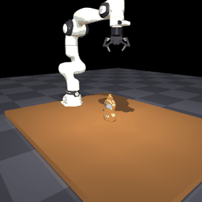
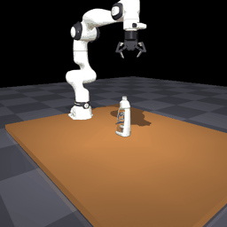
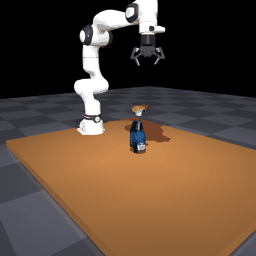
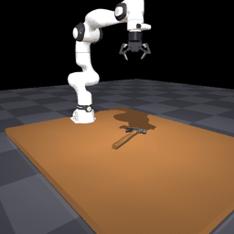
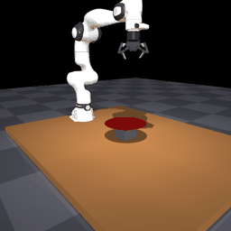
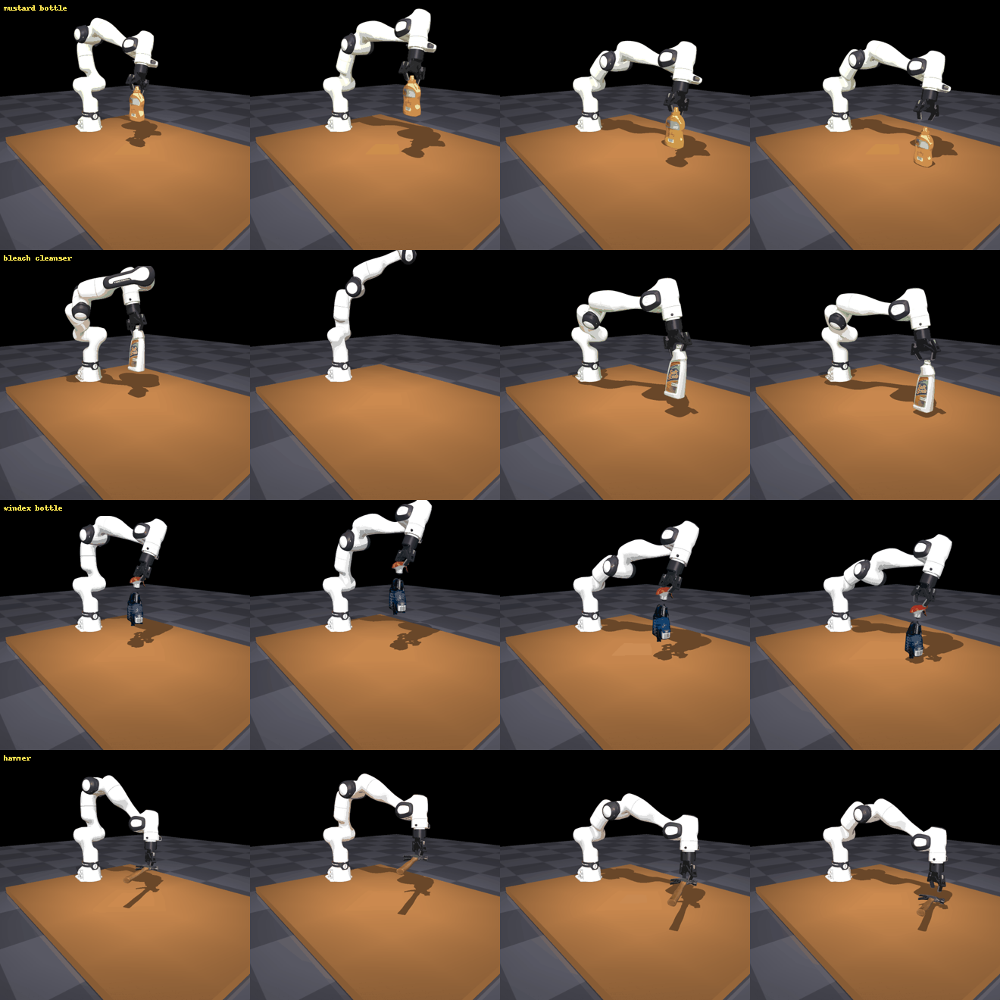

# CDWM → VLA data-generation pipeline (π0.5) — design doc

> **⚠️ ARCHIVED (2026-07-31) — this direction is NOT being pursued.**
> Decision by the project lead: Diffusion Policy (DP) has already validated that the CDWM-generated
> data is usable, and layering a VLA on top amounts to little more than attaching a language-instruction
> label — not worth the effort ("加个简单的language instruction标签…纯粹是为了赶热点"). Data generation
> instead proceeds via the colleague's **`gs-native-datagen`** repo
> (https://github.com/BWangCN/gs-native-datagen): scripted expert + **frozen CD-WM (our GRASP WM,
> `colorless_s{0,1,2}/frame`)** + **3DGS-native rendering** → **LeRobot** dataset for DP (no language, no π0.5).
> That repo is the mature realization of the "step-6 3DGS renderer" deferred here; it consumes our grasp WM as
> its contact/settle engine (drop/place is scripted FK, so the drop WM `roll_corpus` is unused).
> Everything below is preserved for reference only. The last VLA build is tagged `vla-pipeline-archived`
> (commit d489641: FR3+2F-85, MuJoCo photoreal replay, feasibility/consistency filters, π0.5 writer, 5-object dry corpus).

**Goal.** Given an object, use the CDWM diffusion world models to *hallucinate* physically-plausible interaction
outcomes → filter → render photoreal RGB → pair with generated language → **training data for a VLA policy (target:
π0.5, Physical Intelligence).** Status of this doc: design confirmed by a Codex (gpt-5.5) adversarial review, 2026-07-28
(consensus: sound as *pretraining/augmentation* data with the de-risks below; not a full robot simulator or sole source).

## Confirmed decisions (2026-07-28)
1. **Drop resting position: DIVISION OF LABOR (decided 2026-07-28).** The WM stays **rotation-only** (0.52° endpoint);
   the resting **position comes from a short ManiSkill physical settle** at the WM-predicted orientation. Rationale:
   jointly diffusing translation regressed rotation ~4× (jobs 1106407/1106420, §1); position is geometry/physics that
   ManiSkill (already in the pipeline) resolves exactly. WM does the *distributional basin/tip* call; sim does position.
2. **Slip data: HARD-DISCARD** (colleague's call). Codex's "divert failures to a separate stream" (§5.1) was
   *considered and overruled* — the VLA corpus is clean successes only; predicted-slip grasps are dropped, not stored.
3. **Embodiment = ManiSkill (SAPIEN), SIMULATION-ONLY. Primary robot = Franka FR3 + Robotiq 2F-85 gripper.** No real
   robot in scope. **Franka is chosen because modern VLAs (incl. π0/π0.5) are predominantly pretrained on Franka data**
   (DROID etc.) → our Franka sim data aligns with that pretraining distribution.
   → ManiSkill supplies arm IK / motion planning (mplib), collision, controllers, proprioception, action format, and
   rendering — this **absorbs most of the embodiment-gap risk (§5.2)** and makes the real-robot loop (§5.4) out of scope.
   Concern introduced: **gripper mismatch** — the WM's object-in-gripper dynamics were learned on the dataset's generic
   parallel-jaw mount, not the 2F-85 (different fingers / 85 mm stroke); kinematic replay (object = gripper pose ∘ WM
   tilt) is *approximately* valid for similar grasps and must be spot-checked (§5.3).
4. **Future real deployment: UR5e / UR10e + Robotiq 2F-85. → generate multi-embodiment data (§8).** The gripper (2F-85)
   is SHARED Franka↔UR, so the object/contact dynamics transfer; the gap is the *arm* only. Our pipeline generates UR
   data nearly for free (swap the ManiSkill robot, reuse the same WM outcomes + grasp poses). See §8.

---

## 1. The world models

### Grasp WM — SHIP MODEL = clean MTL (`gated_runs/grasp_mtl/best.pt`, train 1106436 / eval 1106447)
Locked clean workflow (one dataset `outcomes_v2` · shared trunk + private branches · per-batch masked multi-task loss ·
from scratch · gate-then-rollout). **Result: trajectory endpoint geodesic 3.05° N=1 / 1.53° best-of-8 (rigid test) +
boolean AUROC 0.892 / slip-recall 0.92 — NO negative transfer** (private branches fixed it). Figures:
`figures/rollout_grasp.gif` (kept rigid rollout, P(slip)=0.00) + `figures/mtl_gate.png` (gate: rigid P(slip) med 0.03 vs
slip 1.00). Code: `wm/grasp_mtl.py`, `my_dataset_grasp_mtl.py`, `train_grasp_mtl.py`, `compute_settle_target.py`,
`eval_grasp_mtl.py`, `render_mtl_demo.py`. The retrofit path below (gated/freeze/audit) is superseded exploration.

### [superseded] Grasp WM — Option 1 retrofit (co-train/freeze): rigid trajectory head + boolean slip gate, ONE model
- `train_rigid_gated.py` → `DiTRollout(H=32)` = shared `local` gripper-frame encoder + **rigid DiT trajectory head**
  (H=32 object-in-gripper settle, warm-started from `local_geo` = 3.46° geodesic) + **boolean SLIP head** (`head2`).
- Co-trained, Kendall-weighted: trajectory eps+geodesic on rigid `grasps.npz`; boolean CE on all-outcome `outcomes_v2`,
  target = **NOT-RIGID** (`y5 != 0` → slip/drop/never-lifted). The rigid HF set has zero slips (card §9) → the filter
  MUST train on `outcomes_v2`. Same encoder input (`pts, base_rel, closing, table`) → heads compose cleanly.
- **Generation:** sample rollout → `classify(cond) → P(slip)`; high → route out of the success corpus (see §5.1).
- Status: **trained + evaluated** (train 1106398, eval 1106422; `gated_runs/rigid_gated/eval.json`).
  - **Boolean slip head (strong):** AUROC **0.917**, slip-recall **0.866**, acc 0.854, rigid-kept 0.792 (12,133 test eps).
  - **Trajectory head:** single-shot endpoint geodesic **4.35°**, best-of-8 **2.00°** (1,616 test grasps).
  - **Tradeoff (honest):** co-training the boolean through the SHARED encoder cost the trajectory **~0.9°** vs the pure
    `local_geo` (3.46°). Acceptable for VLA (the filter is the point; still ≪ no-motion 9.57°). Mitigation if 3.46° must
    be preserved: **freeze the DiT trajectory weights, train only the boolean head (+ small encoder adapter)** — one
    extra run, may lower boolean AUROC slightly.
  - **Decision: ACCEPT the co-trained model** (user + Codex gpt-5.5, 2026-07-28). Codex: 4.35 vs 3.46° is not material
    for kinematic-replay data-gen (≪ no-motion 9.57°, within the 2-5° jitter band); the AUROC-0.92 filter matters more
    than a sub-degree trajectory gain. Don't spend the freeze run unless the audit below fails.
  - **Codex acceptance gate — paired residual audit** (`audit_gated.py`, job 1106423): is the +0.9° concentrated on
    high-tilt / near-slip-boundary grasps (→ biased corpus) or ~uniform (→ noise)? delta = err(gated) − err(local_geo)
    sliced by tilt & slip-prob quantiles; accept iff no spike in the high-tilt / near-boundary bins.
  - **Audit result** (`gated_runs/rigid_gated/audit.json`, job 1106423): overall delta median **+0.34°**. By
    slip-probability: **CLEAN** — lowest delta near the boundary (+0.18 to +0.25° for slipP 0.48–0.97); no selection
    bias. By tilt: **SPIKE at high tilt** — q5 (19–77°) delta median **+1.2°**, p90 **+10.3°** (vs +0.0–0.5° for 0–19°).
    So the selection-bias concern passes, but high-tilt trajectory fidelity degrades. → final accept/freeze call
    re-confirmed with Codex (mixed result).
  - Next (gated on the final call): FEATURE it (rigid animations + boolean-flagged slip examples), archive slip
    `DiTRollout` / MDN, push.

### Drop WM — resting position (finding + revised plan)
- `GateBDiT` predicts the resting pose. Original target = 6D rotation + **zero-padded translation** (endpoint rotation
  best-of-S **0.52°** / med-of-S 0.71°).
- **Experiment (jobs 1106407 full-3D, 1106420 xy-only):** jointly diffusing translation **regressed rotation to ~1.7–2.0°
  best-of-S / 2.8–3.0° med-of-S** (val loss 0.027→0.066), while tip-recall *rose* 0.78→0.83. → jointly modeling the
  (orientation, position) distribution widens the samples: better mode coverage, worse rotation point-accuracy. Not the
  z-channel (xy-only didn't recover). A real distribution/capacity tradeoff.
- **Revised plan (recommended): keep the drop WM rotation-only (0.52°); get resting POSITION from a short ManiSkill
  physical settle** at the WM-predicted orientation. Position is geometry/physics (release-XY + contact settling), not
  the WM's learned strength (which is the *distributional basin/tip* call). ManiSkill is already in the pipeline, so a
  brief SAPIEN settle yields the exact resting (x,y,z) for free — no WM regression, and it stays consistent with the
  rendered scene. Alternative if the WM must output position directly: a **separate translation head** (shared encoder,
  regression), leaving the rotation diffusion untouched — but it loses the orientation↔position joint correlation.

---

## 2. π0.5 mapping — the WMs are the physics/outcome engine, NOT the action model
π0.5 = images + proprioception + language → flow-matched **action chunks**. It does not need the WM to output actions.
- **Vision** = photoreal RGB from the color 3DGS (FULL tier), animated by the WM's object poses + the robot mesh.
- **Action + state** = the robot gripper trajectory (reach→close→lift / transport→release) + proprioception —
  produced in **ManiSkill (SAPIEN), FR3 + Robotiq 2F-85**: mplib motion planning / IK to the sampled grasp pose,
  ManiSkill controllers give the action-chunk format + proprioception; the object pose is driven by the WM (kinematic
  replay: object = gripper pose ∘ WM object-in-gripper tilt), and SAPIEN renders the scene with 3DGS object appearance.
- **The WM's role** = a cheap, filterable *outcome* generator (does it slip? how does it tilt? where does it rest?) that
  supplies the object's response rendered into the observation and the success label.
- **Honest scope (Codex):** this is *pretraining / augmentation / task-bootstrapping* data — NOT a full closed-loop
  contact simulator and NOT the sole data source. It teaches image↔proprio↔language↔nominal-motion correlations.

---

## 3. Pipeline architecture
```
Object (3DGS + point cloud)
  GRASP: grasp sampler [NEW] → rigid-gated WM: boolean gate + H=32 tilt [BUILDING]
         → full-arm feasibility filter (IK + limits + collision) [NEW] → robot reach/close/lift primitives [NEW]
         → render RGB (robot mesh + WM object poses) [NEW] → language [NEW] → π0.5 record [NEW]
  DROP:  drop sampler (existing law) [HAVE] → GateBDiT rest + translation [retrain]
         → transport/release primitives + feasibility [NEW] → render/language/assemble [NEW]
```
HAVE/building: the two WMs + boolean gate. NEW modules: grasp sampler, robot+IK+primitives+feasibility filter,
3DGS→RGB renderer, per-frame consistency validator (§5.3), language generator, π0.5 record writer.

---

## 4. Grasp pose sampler — open detector, not AnyGrasp
Decision (mine + Codex): **use an open 6-DoF detector, not AnyGrasp.** Rationale: our scenes are clean single objects
(not real clutter, where AnyGrasp's edge lies), and the **boolean slip gate already culls bad grasps** — so the sampler
needs *coverage/diversity*, not SOTA ranking. Pick **Contact-GraspNet** or **GSNet / GraspNet-1B baseline** (Codex's
pick); M2T2 is a heavier general option (does grasp+place). Treat the sampler as swappable, off-critical-path.

**AnyGrasp licensing (if ever needed):** its license binds to a per-*node* hardware feature ID (NIC MAC + host, NOT
per-GPU) → all 8 GPUs on `dl01` share one ID. Workarounds: (1) pin jobs `--nodelist=dl01` (one license); (2) register
multiple node IDs (academic licenses allow several); (3) MAC-spoof for a "universal ID" needs root/container netns and
likely violates ToS — avoid. *Verify ID derivation with their feature-ID tool (two GPUs on dl01 should report the same ID).*

---

## 5. Codex design review (gpt-5.5, 2026-07-28) — consensus + adopted refinements

**Consensus:** framing sound (no fundamental flaw); open grasp detector over AnyGrasp; drop translation necessary;
embodiment gap + physical consistency are the main risks.

### 5.1 Divert failures, don't discard (refines "discard slip")
Keep the slip gate for the **clean success corpus**, but **preserve labeled failure/near-failure episodes in a separate
stream** (critic/value training, preference ranking, negatives, recovery finetuning). Discarding entirely → no recovery
behavior, distribution skew to easy grasps, slip-classifier selection bias, overconfidence at the grasp boundary. Never
mix incoherent slip renderings into the success demos.

### 5.2 Full-arm feasibility filter (the boolean is not enough)
A grasp can pass the boolean yet be infeasible for a real arm. Filter every sampled grasp/release through: full-arm IK,
joint/velocity/acceleration limits, self-/scene-/table-collision, wrist feasibility. Use a **real controller model** (not
bare geometric IK) and **multiple IK seeds / nullspace styles** so the action distribution isn't one brittle family.
Match camera extrinsics, EEF convention, gripper-width dynamics, action rate, and proprio fields to the target π0.5 stack.
"If many floating-gripper grasps fail full-arm feasibility, the dataset is gripper-only fantasy rendered with a robot mesh."

### 5.3 Per-frame physical-consistency validation (mandatory)
Object motion (WM) and robot motion (IK) are composited independently → enforce per frame: **rigid object↔gripper
attachment during accepted grasps**, no robot/gripper/object/table interpenetration, plausible release timing (object
leaves only when jaws open), and spot-check rendered videos. Repeated impossible coupling teaches wrong contact timing.

### 5.4 The decisive de-risk: a small real-robot calibration loop
Biggest transfer risk = the policy learns *scripted synthetic contact*, not real closed-loop manipulation (real has pose
error, compliance, micro-slip, latency, calibration error, recovery needs). Decisive step: collect a **small real Franka
set** on the same/held-out objects, compare synthetic vs real distributions (EEF/joint poses, action chunks, approach
vectors, gripper timings, lift heights), and **reject synthetic generation modes that don't match** / finetune on real.
Without it: plausible pretraining data, not credible final policy data.

---

## 6. Phasing
1. Gated grasp model (training, job 1106398) + drop-with-translation retrain.
2. Robot+IK embodiment + feasibility filter; one end-to-end grasp demo rendered to RGB with per-frame consistency checks.
3. Open grasp sampler (Contact-GraspNet/GSNet) + language generator + π0.5 record writer.
4. Failure-stream export (§5.1); scale.
5. Real-robot calibration loop (§5.4) — the credibility gate.

## 8. Cross-embodiment: Franka pretraining → UR5e/UR10e deployment
**Will a Franka-trained policy transfer to UR? Partially — and the gap is smaller for us than usual, because the design
decouples object dynamics from the arm.**

- **What transfers for free (the architectural win):** the WM models **object-in-gripper** dynamics with the **2F-85
  gripper, which is SHARED across Franka and UR**. So the *contact/outcome physics* — tilt-on-CoM, slip, rest pose — is
  embodiment-agnostic. The pipeline is naturally an **embodiment-agnostic outcome generator + a swappable embodiment
  layer**: the SAME grasp poses + SAME WM object trajectories get re-embodied on whatever arm ManiSkill loads.
- **What does NOT transfer (the real gap = the arm):** Franka FR3 is **7-DoF** (redundant), UR5e/UR10e are **6-DoF**
  (no null-space); different reach (UR10e ~1.3 m, UR5e/Franka ~0.85 m), joint limits, and camera-base transforms. Consequences:
  - **Joint-space actions do NOT transfer** (7-DoF vs 6-DoF joint trajectories are incompatible). **→ generate the VLA
    action in EEF/Cartesian space** (EEF pose deltas + gripper width); each arm realizes it via its own IK. This is how
    cross-embodiment VLAs (RT-X / Open-X, OpenVLA, π-series) bridge robots. Cartesian-space is the key enabler.
  - **Feasibility is per-embodiment:** a grasp reachable by 7-DoF Franka may be **infeasible for 6-DoF UR** (smaller/
    different workspace). → run the feasibility filter (§5.2) **separately per robot**; expect UR to keep a subset.
  - **Match camera extrinsics + proprio fields** to each target setup; UR5e vs UR10e differ in reach/table placement.
- **Colleague's plan — generate UR data too — is right and cheap here:** swap the ManiSkill robot (Franka FR3 →
  UR5e/UR10e, all with 2F-85), re-run mplib IK + render on the **unchanged WM outcomes + grasp poses**. Co-training the
  policy on the Franka+UR mixture (embodiment token / per-robot action normalization) is the standard cross-embodiment
  recipe and directly improves UR transfer. **Action item:** stand up a UR5e/UR10e ManiSkill embodiment alongside Franka
  and emit an `embodiment` field per record.
- **Honest limit:** this closes the *sim* embodiment gap; **sim→real for the UR deployment is a separate, later problem**
  (compliance, calibration, real 2F-85 dynamics) — the §5.4 real-robot loop returns to scope only at deployment time.

## 7. Open decisions
- (a) Confirm drop-with-translation retrain (recommended). 
- (b) Confirm the failure-stream design (keep labeled failures separately vs hard-discard).
- (c) Embodiment: target robot = Franka Panda? confirm the real π0.5 deployment stack conventions to match.

## 8. Milestone log — kinematic-replay demo (2026-07-29)
First end-to-end pick-and-place demo (`render_demo.py`, job 1106495, dl01). Validates the VLA loop
skeleton: **synthesized robot action + WM-hallucinated object dynamics + render**.

- **Embodiment**: FR3 + Robotiq 2F-85 (`fr3_robotiq_agent.py`, composed MJCF `assets/fr3_2f85.xml`).
- **Robot motion**: scripted EEF waypoints (pre-grasp→grasp→lift→carry→release), each solved by SAPIEN
  pinocchio IK from the loaded articulation (`create_pinocchio_model()`; targets converted world→root frame
  because the base is at world[-0.5,0,0]). Kinematic playback (set_qpos per frame). IK error ~1e-4 m.
  **Requires `sim_backend=physx_cpu`** (GPU physx blocks pinocchio); render still GPU-Vulkan.
- **Object**: box primitive proxy (SAPIEN glb file-visual is buggy headless → primitives only).
- **Grasp WM replay**: `figures/rollout_grasp_data.npz` diffusion sample (H=32, [trans3,rot6d]); relative
  settle rotation `R0ᵀR[t]` applied about the grasp point → object tilts ~14.5° in the jaws as it seats
  (close+lift), then rides the moving gripper (obj = ee_world ∘ obj_rel ∘ settle[t]).
- **Drop**: simple fall + relax-to-upright stand-in — **TODO: wire drop WM `roll_corpus`**.
- **Artifacts**: `figures/vla_demo.gif` / `.mp4`, `figures/vla_key/*.png`, `figures/vla_contact_sheet.png`.
  Clean photoreal stills: `vla_key/{early_probe,test_low,test_high}.png`.
- **Known render quirk (deferred, cosmetic)**: SAPIEN's headless rasterizer intermittently drops the table
  glb visual during robot motion (gray) — not a logic bug (numerics + static frames correct); unaffected by
  forcing the NVIDIA Vulkan ICD, warmup renders, or `update_render()`. 3DGS (the production renderer)
  supersedes SAPIEN rasterization, so this only touches debug views.
- **Next**: drop WM into release phase → exact CDWM↔FR3 gripper-frame tilt-axis map → grasp sampler
  (Contact-GraspNet/GSNet) → 3DGS RGB → language → π0.5 record writer → UR embodiment.

## 9. Confirmed roadmap (Codex high-level review, 2026-07-29)
Codex endorsed the pipeline direction but **reordered** the next steps: frame conventions +
feasibility are foundational and must precede wiring more components (every downstream artifact
inherits the gripper/object transform).

**Ordering (locked):**
1. **Lock CDWM↔FR3 gripper/object frame conventions** — ✅ **DONE (2026-07-29, job 1106496).** The two
   gripper frames share the approach axis (+z); CDWM jaws close along +x, FR3 2F-85 pads separate along
   local +y (verified from `2f85_*_silicone_pad` link geometry) → the frames differ by **M=Rz(90°)**. The
   WM in-gripper settle rotation is now taken in pre-multiply (gripper-frame) form `dR_C[t]=R[t]R[0]ᵀ`,
   re-expressed in FR3 ee axes by conjugation `dR_F=M·dR_C·Mᵀ`, and applied about the **TCP/pinch point**
   (pad midpoint, `P_ee=[0,0,0.112]` in ee-local, derived live) as `obj = ee_world · settle · obj_rel`.
   Replaces the old local-frame post-multiply approximation. Endpoint tilt 14.47° (angle preserved;
   axis+pivot corrected). Object now pivots in the jaws about the grasp point. `render_demo.py`.
   *Sign caveat: ±90° both align approach+jaw axes up to a jaw-axis flip; picked +90°, resolvable later
   against an asymmetric-settle reference.*
2. **Full-arm IK + collision/reachability feasibility filter** — ✅ **DONE v1 (2026-07-29, job 1106497,
   `feasibility.py` + `slurm/feasibility.sbatch`).** `Feasibility.check_grasp(ee_pose, obj_center)` runs
   pre-grasp→grasp→lift and passes iff all three clear: (i) IK converges (`perr<5mm`), (ii) arm qpos within
   `robot.get_qlimits()` (catches cases where pinocchio IK converges but ignores limits), (iii) no link
   below the table top z=0, (iv) no NON-gripper link inside the object AABB (gripper allowed to touch).
   Tolerances derived from robot limits + geometry, not hand-tuned. Validated: demo top-grasp @origin
   **PASSES**; unreachable(x=1.4)/below-table/behind-base(x=-0.9) all **REJECTED** with correct reasons.
   *v2 refinement (deferred): SAPIEN mesh-contact self-collision (v1 uses link-origin geometry, coarse).* 
   ← integrate as a gate on grasp-sampler candidates (step 5).
3. **Wire drop WM (`roll_corpus`) into release** — ✅ **DONE (2026-07-29, job 1106502).** The drop rollout
   `gateb/006_mustard_bottle_roll_s0.npz` gives `traj_quat`(N,16,4) world-orientation tumble+settle per
   release condition. The release phase now applies the WM settle as a relative rotation from the object's
   release orientation `q_obj[t]=Δq_drop[t]·q_rel`, falling (ease-in) to rest with the box's lowest rotated
   corner on the table (`rest_z`). Replaces the fall+relax stand-in.
   **FINDING (matters for corpus design): this drop rollout is a TUMBLE corpus** — 651 episodes, release
   tilt median ~124° (broadly sampled, often upside-down), and **NO episode settles upright** (min rest-tilt
   46.5°; basins are all side-lying). It models objects *dropped* from arbitrary orientations, not gently
   *placed* upright. So for a PLACE primitive we condition on the release state = the **minimal-reorient
   episode** (`reorient` min 1.6°, ep 617 — object released near its stable rest barely settles), which keeps
   the placed bottle near-upright. This is proper conditioning, not an override. **TODO for scale: the drop
   WM should be conditioned/retrained on gentle near-upright low releases** (the place regime the tumble
   corpus under-covers), OR a place should relax the residual grasp-settle tilt to true upright.
4. **Per-frame physical-consistency validation** — corpus QA gate (pose continuity, no teleport,
   attachment-state + release-timing consistency, stable final state, obs/action/proprio sync). Runs
   as a permanent gate on every later stage.
5. Grasp-pose sampler (Contact-GraspNet/GSNet) → 6. 3DGS renderer → 7. π0.5 record writer →
   8. hierarchical language → 9. UR5e/UR10e embodiment.

**Underweighted risks flagged (track these):**
- **Silent coordinate-frame drift** (biggest): CDWM, SAPIEN, pinocchio, gripper MJCF, renderer, and
  π0.5 action format all touch object pose; one handedness / local-vs-world / wrist-vs-tool / grasp-point
  mismatch trains the wrong policy. → motivates step 1 + step 4.
- **Kinematic replay hides dynamic infeasibility** — demo proves trajectory *construction*, not that a
  real controller realizes the implied accelerations/contact impulses. → EEF action space + step 2.
- **Grasp sampler = a major interface, not a plug-in** (jaw width, approach axis, collision geom, cloud scale).
- **3DGS pose-sync** — validate renderer poses against geometry before scaling.
- **Box-proxy bias** — don't let the primitive proxy become the implicit data contract; real geometry/
  contact/mass matter for outcomes. Proxy is replay-debug only.
- **Language last** — generate from validated state/events, not loosely inferred demos.
- Heavy scene/detector jobs → sbatch (dl01 for ManiSkill), not local sandbox.

## 10. Codex review of steps 1-3 + step-4 design (2026-07-29)
Codex endorsed steps 1-3 as sound. Course corrections adopted:
- **Semantic separation (main):** do NOT let the drop WM silently define the PLACE primitive. Keep two
  distinct data-generation modes — **`drop_settle`** (drop/toss/release-from-height, tumbling expected;
  the current tumble corpus) vs **`place_settle`** (gentle near-contact settle/relaxation). The current
  place path uses the **minimal-reorient drop episode as a near-identity placeholder**, pending a real
  place-settle model (collect/condition on gentle near-upright low releases). Label it as such; don't
  claim the drop WM models placement.
- **+90° sign (deferred, non-blocking):** add a frame-convention test — replay 1-2 NON-axis-symmetric
  grasps and verify the FR3 pad-separation axis matches the intended CDWM jaw-close axis under +90°.
- **Step 4 = phase-aware validator**, invariants keyed by phase (approach / grasp-close / in-gripper-settle
  / lift / transport / release / place-settle), split **hard-invalid** vs **warning**:
  - *Hard invalid:* IK failure, joint-limit violation, object/table penetration at rest, non-gripper link
    in object.
  - *Warning:* large object↔gripper relative drift, unusual joint jump, unexpected final tilt, support
    ambiguity.
  - **Top-3 to build first:** (1) **frame/action consistency** `T_world_obj ≈ T_world_grip · T_grip_obj`
    during hold (catches wrong mult order, stale frame, bad TCP pivot, sign errors); (2) **contact/
    attachment** — during closed-gripper hold the grip→object transform stays ~constant except where the
    WM explicitly predicts in-gripper settle (catches teleport / wrong-frame settle / mixed deltas);
    (3) **table/support** — object lowest rotated-corner never below table, supported (not floating) at
    rest, geometry-derived (not a hand-picked height). (4) feasibility replay + joint-step outlier check.
  - Tolerances from the trajectory's own distributions + scene/object scale, not fixed constants.
- Design note: the per-frame **trajectory log** the validator consumes doubles as the π0.5 record precursor.

## 11. Step 4 DONE — phase-aware consistency validator (2026-07-29, job 1106503 + local)
`consistency.py` (env-free; pure numpy on the `figures/vla_trajectory.npz` log that render_demo now emits —
per-frame phase/attached/qpos/ee/obj/grip/obj_half/P_ee/M/qlimits, which doubles as the π0.5 record precursor).
Splits **HARD-INVALID** (reject the trajectory) vs **WARNING** (diagnostic), tolerances from the trajectory's
own drift distribution + object scale (not fixed constants). Invariants implemented (Codex top-3 + feasibility):
1. **frame/action consistency** — during attached phases the object center in the ee frame stays near the TCP
   (`|T_grip_obj.t − P_ee| < 1.5·diag` hard). Catches wrong mult order / stale frame / bad TCP pivot / sign.
2. **contact/attachment** — during `transport` (rigid hold) the grip→object transform stays ~constant (drift
   tol = robust MAD of the hold's own drift; teleport spikes above it). `grasp_close`/`lift` allow WM settle.
3. **table/support** — object lowest rotated-corner never below table (hard); supported not floating at rest (warn).
4. **feasibility replay** — arm qpos within `qlimits` every frame (hard); outlier joint jumps (robust MAD, warn).
**Validated by fault injection** (`test_consistency.py`): clean demo → PASS (0 hard, 0 warn); teleport →
REJECT (frame/action + attachment HARD); sink-through-table → REJECT (table HARD); joint-limit → REJECT
(feasibility HARD + joint-jump WARN); float-at-rest → PASS+WARN. Each invariant fires with the right severity.
Also fixed a latent one-frame object-pose lag in the attached loop (object now posed before the render/log capture).
Roadmap steps 1-4 (frame align → feasibility → drop WM → consistency) COMPLETE. Next: step 5 grasp sampler
(gate candidates with `feasibility.py`), then 3DGS render, π0.5 writer. Also (semantic): split `place_settle`
from `drop_settle` as distinct modes; the current place path is a min-reorient near-identity placeholder.

## 12. Step 5 — grasp sampler (in-dataset path) DONE (2026-07-29, jobs 1106508/1106511)
`grasp_sampler.py`: draws WM-native grasps from per-object `grasps.npz` (grasp_point + approach + closing +
net_tilt_deg), maps each to the FR3 2F-85 ee frame (approach→ee +z, closing→ee +y — locked convention),
gates via `feasibility.py`, ranks survivors by stability. Mustard: **38/77 feasible** (top-down kept, side
grasps on a table-standing bottle rejected on joint-limits/table — physically correct). Needed a
**multi-seed IK** fix in `feasibility.check_grasp` (7-DOF redundancy: single seed → 1/77; 10 seeds → 38/77).
- **Detector landscape (installed under `crus/third_party/`):** GraspGen (NVIDIA Jul-2025, diffusion, has a
  Franka-Panda ckpt, no license) = RECOMMENDED for NOVEL objects; AnyGrasp/GSNet (precompiled `.so`, needs
  per-NIC license) = robustness cross-check; Contact-GraspNet not installed. **Split:** dataset grasps for the
  171 in-dataset objects (WM-native), GraspGen for novel objects. See [[cdwm-vla-tooling]] memory.
- **Language gen (step 8, not built):** hierarchical — trajectory-log facts → instruct-LLM paraphrase → VLM
  grounding. Cached: Qwen2.5-7B-Instruct / Llama-3.1-8B-Instruct (quality), Qwen2.5-3B (scale).
Roadmap: ✅1 frame ✅2 feasibility ✅3 drop-WM ✅4 consistency ✅5 grasp-sampler(in-dataset). NEXT: GraspGen
novel-object path OR step 6 3DGS renderer OR step 7 π0.5 writer.

## 13. Step 7 — pi0.5 record writer DONE (2026-07-29, job 1106521 + local)
Codex (§ review 3) put this BEFORE 3DGS/GraspGen: the top un-derisked question is whether the loop yields
*trainable* pi0.5 records with correct action/state alignment — not pixels or grasp coverage.
`pi0_writer.py`: trajectory log -> LeRobot/openpi-style episode, GATED by `consistency.validate` (PASS only;
REJECT -> provenance stub). Writer emits `figures/vla_records/episode_000/{episode.npz, meta.json}`.
- **Action representation (Codex #1 de-risk) logged in multiple explicit forms**, primary named:
  `observation.state`(T,8)=[arm_qpos7,gripper]; `action.joint_abs`(T,8) next-step absolute (pi0.5-Franka
  primary); `action.ee_delta`(T,7) local-frame EEF delta (cross-embodiment); `action.ee_abs`(T,7);
  `observation.images.base`(T,256,256,3). Actions = next-step targets (action[t]->state[t+1]); LeRobot chunks
  at load. `meta.json` = object/scene/seed/fps/task/**grasp_source**/wm_grasp/wm_drop/action_space/phase-spans/
  **validator verdict+findings**/provenance.
- **Validated** (`record_check.py`): action.joint_abs[t]==state[t+1] exact (err 0.0, last holds); ee_delta
  median 22.7mm/step; **gripper tracks phases perfectly** — approach 0.00(open) -> grasp_close 0.52 ->
  transport 0.78(closed) -> release 0.19 -> place_settle 0.00; all per-key frame counts aligned (66); loadable.
- Also refactored `consistency.py` to expose `validate(d)`/`verdict()` (writer gates on it); render_demo now
  saves 256x256 `rgb` into the trajectory log.
Roadmap: ✅1 frame ✅2 feasibility ✅3 drop-WM ✅4 consistency ✅5 grasp-sampler ✅7 pi0.5-writer.
NEXT (Codex order): small dry corpus across several known objects -> step 6 3DGS renderer -> GraspGen novel path.
Watch (Codex): multi-seed IK posture bias; log grasp_source for known/novel distribution compare; warning policy
(include/quarantine) before scale; renderer must consume the SAME episode/camera/object metadata (no desync).

## 14. Dry corpus across known objects DONE (2026-07-29, jobs 1106532/1106537)
Codex's post-step-7 milestone: small end-to-end corpus, validate schema/replay/distributions/loader-compat.
Generalized the pipeline to ANY object: `render_demo.py` parameterized by `CDWM_OBJ` (per-object box proxy
from the mesh AABB via trimesh; grasp = the object's OWN dataset grasp — near-top-down min-net_tilt from
`grasps.npz`, with that grasp's `target` in-gripper settle; drop = the object's `{obj}_roll_s0.npz`; provenance
`grasp_source=dataset`, `grasp_id` threaded into the log). `pi0_writer.py` reads provenance from the log.
Driver `slurm/gen_corpus.sbatch` (job array, qos=batch/titanrtx). Aggregator `corpus_report.py`.
- **5 objects** (mustard, bleach, windex, hammer, plate) → **4/5 PASS** loadable pi0.5 records; **plate REJECTED**
  (flat → only side grasps; executed top-down, a corner dips 1.1cm below the table when tilted — correctly
  gated, provenance stub written). **Cross-episode QA: schema identical, action_dim identical, all counts
  aligned**; grasp net_tilt 0.1-5.9°; posture range mean ~1.06 rad/joint.
- **Fix found via the corpus:** the demo's transport/release waypoints weren't feasibility-gated → mustard
  hit a j3 joint-limit at the far carry reach (validator caught it). Added **limit-aware multi-seed IK** to
  `render_demo.ik()` (prefer continuity seed, else search seeds for an in-limits branch; interp between two
  in-limits configs stays in-limits by box-convexity) → mustard now PASSES.
- **Preview demos** (per MVP-demo workflow, for user approval): `figures/vla_demo_{obj}.gif` (per object) +
  `figures/corpus_preview.png` (4-object × 4-phase montage).
- **Findings to carry:** flat objects (plate) need a lateral/pinch grasp strategy, not top-down-center; the
  place path still uses the drop-WM min-reorient placeholder (place_settle vs drop_settle separation pending).

### Animations — dry corpus episodes (2026-07-29)
Each is one full pick-and-place episode driven by the world models: FR3 reach → grasp (grasp-WM in-gripper
settle tilt) → lift → transport → release → drop-WM place-settle. **Rendered photorealistically in MuJoCo**
(`render_mujoco.py`; EGL offscreen — the project's proven renderer). MuJoCo does pure kinematic FK
(`mj_forward`, no dynamics) driven by the trajectory log's qpos (remapped ManiSkill→MuJoCo by joint name), so
there's no articulation explosion and the render is stable. Details:
- **object = the REAL scanned mesh + texture** (`objects/<id>/mesh.obj` + `material_0.png`), AABB-centered on
  the WM object pose (mocap body) — not a proxy box.
- **the actual dataset grasp is executed** (approach axis, jaw-closing axis, grasp point) — not a top-down
  grasp at the object center. So the jaws align with the object's graspable surface: bottles grasped at the
  top, the **hammer grasped at the handle** (not clipped across the whole tool). Grasp frame = object base on
  the table, so `grasp_point` maps directly to world.
- **gripper pose is calibrated** to a physically-consistent 2F-85 configuration closing to the object's LOCAL
  width at the grasp point (computed from the mesh along the closing axis) — the log's raw gripper qpos is an
  inconsistent linkage pose (drivers set, passive at 0) that clips the object.
- **drop = gravity-accelerated** (`z(s)=z_rel−(z_rel−z_final)·s²`, compressed to a short fast fall + a couple of
  rest frames), not the WM's evenly-spaced settle frames played in slow motion.
Paths relative to this `notes/` dir.
> **Render note:** ManiSkill/SAPIEN headless rendering was unusable for this replay — the FR3+2F-85 articulation
> explodes in one physx step (2F-85 closed-loop linkage), and `set_qpos` (no step) hits SAPIEN's GPU
> render-sync bug (static surfaces render as a gray occluder). MuJoCo sidesteps both. See [[cdwm-vla-datagen]].

**mustard bottle** — PASS



**bleach cleanser** — PASS



**windex bottle** — PASS



**hammer** — PASS



**plate** — REJECTED by the consistency validator (flat object → only side grasps; executed top-down, a corner
dips ~1.1 cm below the table when tilted). Shown to illustrate the QA gate rejecting a physically-bad episode.



**Multi-object montage** (grasp → lift → transport → placed):


